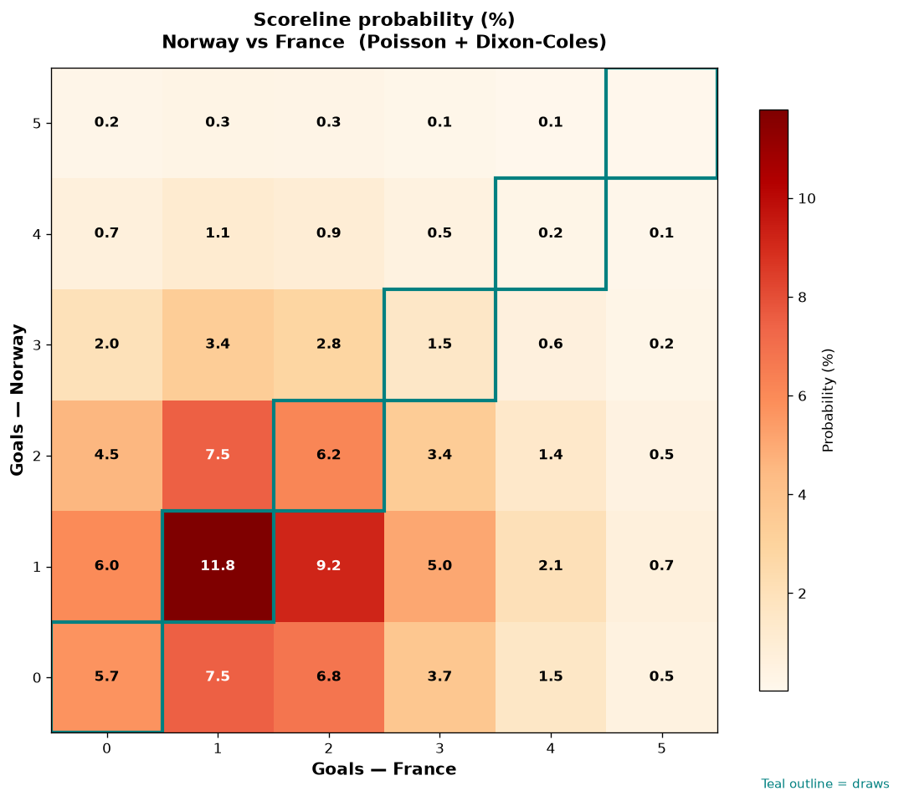

# Norway vs France — 2026-06-26

*Stage:* group  ·  *Engine:* Poisson bivariate + Dixon-Coles + Monte Carlo

## Expected goals (model)

- **Norway**: 1.35
- **France**: 1.65
- **Total**: 3.00  ·  rho = -0.065

## 1X2 (match result)

| Outcome | Model |
|---|---|
| Norway win | **30.7%** |
| Draw | **25.4%** |
| France win | **43.9%** |

*Monte Carlo (50,000 sims):* 30.7% / 25.4% / 43.9% · avg goals 3.01

## Most likely scorelines

- 1-1: 11.8%
- 1-2: 9.2%
- 2-1: 7.5%
- 0-1: 7.5%
- 0-2: 6.8%
- 2-2: 6.2%

## Derived markets

- Both teams to score: 60.6%
- Over 2.5 goals: 57.8%  ·  Under 2.5: 42.2%
- Double chance 1X: 56.1%  ·  X2: 69.3%

## Scoreline heatmap

---
*Informational model output — not betting advice.*