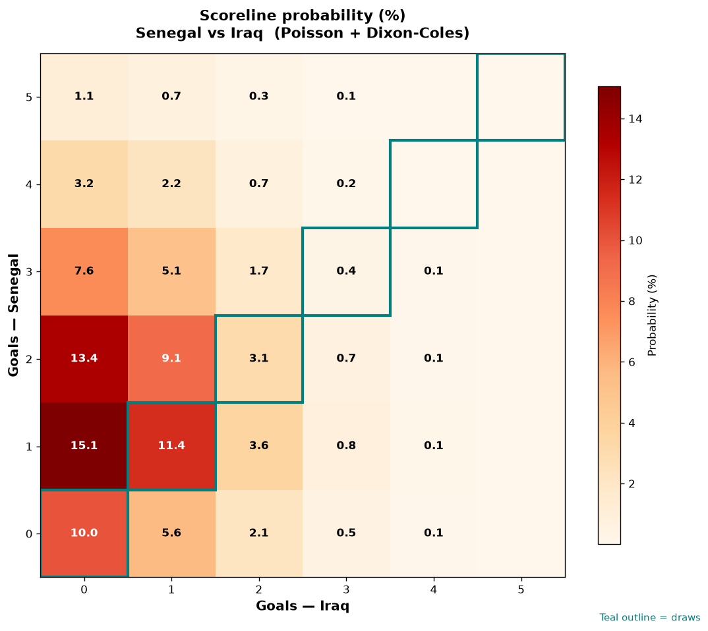

# Senegal vs Iraq — 2026-06-26

*Stage:* group  ·  *Engine:* Poisson bivariate + Dixon-Coles + Monte Carlo

## Expected goals (model)

- **Senegal**: 1.70
- **Iraq**: 0.68
- **Total**: 2.38  ·  rho = -0.065

## 1X2 (match result)

| Outcome | Model |
|---|---|
| Senegal win | **61.2%** |
| Draw | **24.9%** |
| Iraq win | **13.9%** |

*Monte Carlo (50,000 sims):* 61.4% / 24.7% / 13.9% · avg goals 2.38

## Most likely scorelines

- 1-0: 15.1%
- 2-0: 13.4%
- 1-1: 11.4%
- 0-0: 10.0%
- 2-1: 9.1%
- 3-0: 7.6%

## Derived markets

- Both teams to score: 41.0%
- Over 2.5 goals: 42.4%  ·  Under 2.5: 57.6%
- Double chance 1X: 86.1%  ·  X2: 38.8%

## Scoreline heatmap

---
*Informational model output — not betting advice.*