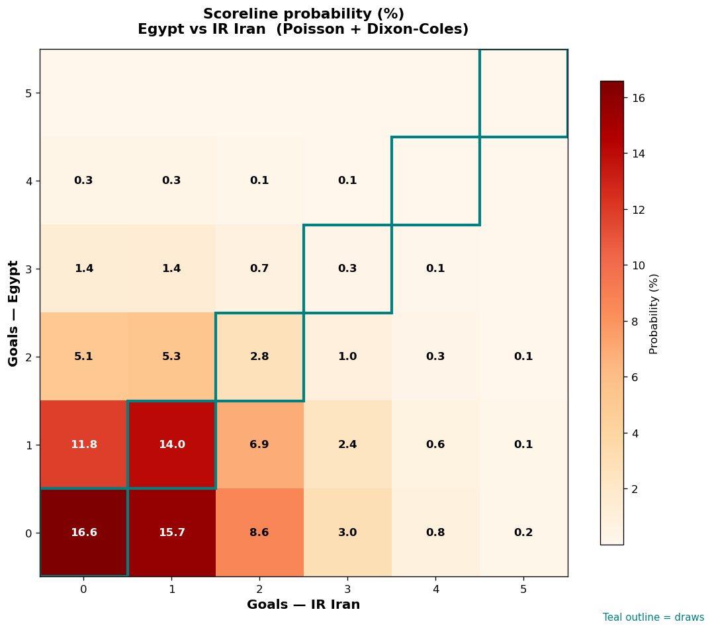

# Egypt vs IR Iran — 2026-06-27

*Stage:* group  ·  *Engine:* Poisson bivariate + Dixon-Coles + Monte Carlo

## Expected goals (model)

- **Egypt**: 0.80
- **IR Iran**: 1.05
- **Total**: 1.85  ·  rho = -0.0619

## 1X2 (match result)

| Outcome | Model |
|---|---|
| Egypt win | **26.6%** |
| Draw | **33.7%** |
| IR Iran win | **39.8%** |

*Monte Carlo (2,000 sims):* 27.2% / 33.1% / 39.8% · avg goals 1.86

## Most likely scorelines

- 0-0: 16.6%
- 0-1: 15.7%
- 1-1: 14.0%
- 1-0: 11.8%
- 0-2: 8.6%
- 1-2: 6.9%

## Derived markets

- Both teams to score: 36.6%
- Over 2.5 goals: 28.2%  ·  Under 2.5: 71.8%
- Double chance 1X: 60.2%  ·  X2: 73.4%

## Scoreline heatmap

---
*Informational model output — not betting advice.*