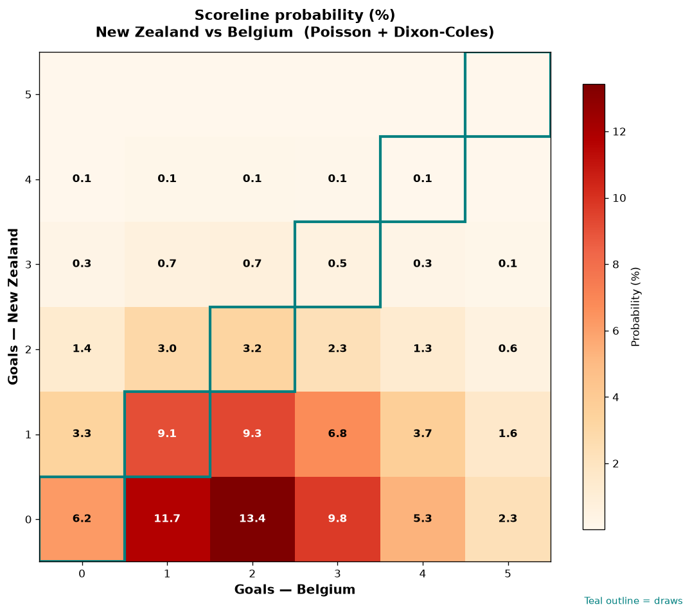

# New Zealand vs Belgium — 2026-06-27

*Stage:* group  ·  *Engine:* Poisson bivariate + Dixon-Coles + Monte Carlo

## Expected goals (model)

- **New Zealand**: 0.69
- **Belgium**: 2.18
- **Total**: 2.87  ·  rho = -0.0675

## 1X2 (match result)

| Outcome | Model |
|---|---|
| New Zealand win | **9.9%** |
| Draw | **19.2%** |
| Belgium win | **71.0%** |

*Monte Carlo (50,000 sims):* 10.0% / 19.1% / 71.0% · avg goals 2.87

## Most likely scorelines

- 0-2: 13.4%
- 0-1: 11.7%
- 0-3: 9.8%
- 1-2: 9.3%
- 1-1: 9.1%
- 1-3: 6.8%

## Derived markets

- Both teams to score: 44.9%
- Over 2.5 goals: 54.8%  ·  Under 2.5: 45.2%
- Double chance 1X: 29.0%  ·  X2: 90.1%

## Scoreline heatmap

---
*Informational model output — not betting advice.*