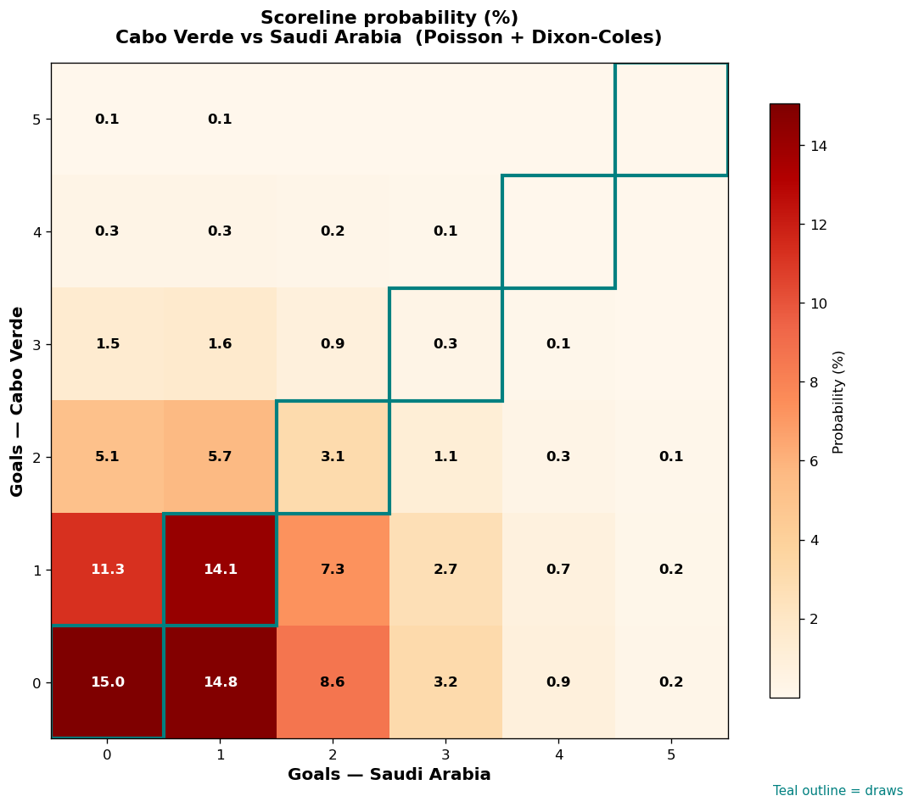

# Cabo Verde vs Saudi Arabia — 2026-06-27

*Stage:* group  ·  *Engine:* Poisson bivariate + Dixon-Coles + Monte Carlo

## Expected goals (model)

- **Cabo Verde**: 0.85
- **Saudi Arabia**: 1.10
- **Total**: 1.95  ·  rho = -0.0619

## 1X2 (match result)

| Outcome | Model |
|---|---|
| Cabo Verde win | **27.1%** |
| Draw | **32.6%** |
| Saudi Arabia win | **40.3%** |

*Monte Carlo (2,000 sims):* 28.4% / 32.2% / 39.4% · avg goals 1.95

## Most likely scorelines

- 0-0: 15.0%
- 0-1: 14.8%
- 1-1: 14.1%
- 1-0: 11.3%
- 0-2: 8.6%
- 1-2: 7.3%

## Derived markets

- Both teams to score: 39.0%
- Over 2.5 goals: 31.0%  ·  Under 2.5: 69.0%
- Double chance 1X: 59.7%  ·  X2: 72.9%

## Scoreline heatmap

---
*Informational model output — not betting advice.*