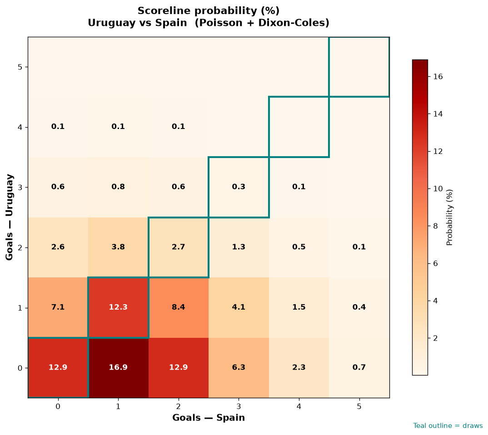

# Uruguay vs Spain — 2026-06-27

*Stage:* group  ·  *Engine:* Poisson bivariate + Dixon-Coles + Monte Carlo

## Expected goals (model)

- **Uruguay**: 0.65
- **Spain**: 1.46
- **Total**: 2.11  ·  rho = -0.0673

## 1X2 (match result)

| Outcome | Model |
|---|---|
| Uruguay win | **15.8%** |
| Draw | **28.2%** |
| Spain win | **55.9%** |

*Monte Carlo (50,000 sims):* 15.6% / 28.4% / 56.0% · avg goals 2.12

## Most likely scorelines

- 0-1: 16.9%
- 0-0: 12.9%
- 0-2: 12.9%
- 1-1: 12.3%
- 1-2: 8.4%
- 1-0: 7.1%

## Derived markets

- Both teams to score: 37.5%
- Over 2.5 goals: 35.3%  ·  Under 2.5: 64.7%
- Double chance 1X: 44.1%  ·  X2: 84.2%

## Scoreline heatmap

---
*Informational model output — not betting advice.*