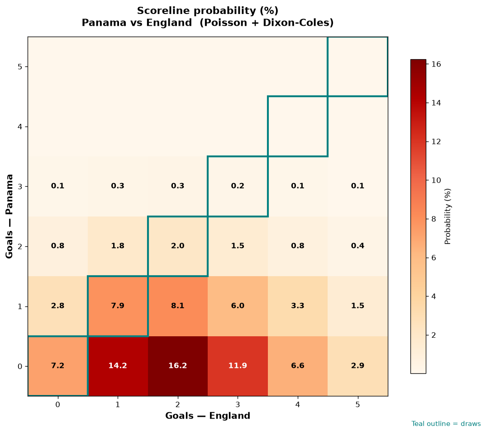

# Panama vs England — 2026-06-27

*Stage:* group  ·  *Engine:* Poisson bivariate + Dixon-Coles + Monte Carlo

## Expected goals (model)

- **Panama**: 0.50
- **England**: 2.21
- **Total**: 2.71  ·  rho = -0.068

## 1X2 (match result)

| Outcome | Model |
|---|---|
| Panama win | **6.5%** |
| Draw | **17.4%** |
| England win | **76.2%** |

*Monte Carlo (50,000 sims):* 6.6% / 17.3% / 76.1% · avg goals 2.71

## Most likely scorelines

- 0-2: 16.2%
- 0-1: 14.2%
- 0-3: 11.9%
- 1-2: 8.1%
- 1-1: 7.9%
- 0-0: 7.2%

## Derived markets

- Both teams to score: 35.5%
- Over 2.5 goals: 50.8%  ·  Under 2.5: 49.2%
- Double chance 1X: 23.8%  ·  X2: 93.5%

## Scoreline heatmap

---
*Informational model output — not betting advice.*