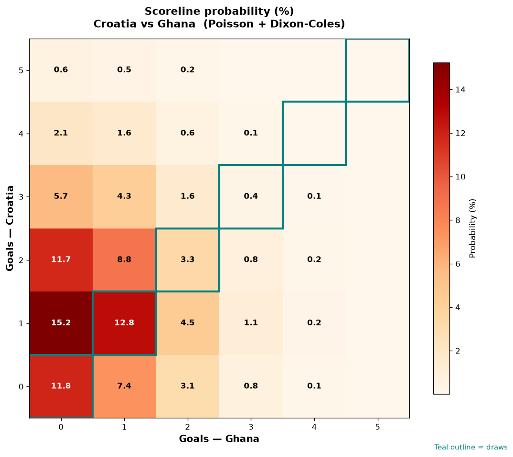

# Croatia vs Ghana — 2026-06-27

*Stage:* group  ·  *Engine:* Poisson bivariate + Dixon-Coles + Monte Carlo

## Expected goals (model)

- **Croatia**: 1.46
- **Ghana**: 0.75
- **Total**: 2.21  ·  rho = -0.0675

## 1X2 (match result)

| Outcome | Model |
|---|---|
| Croatia win | **53.3%** |
| Draw | **28.3%** |
| Ghana win | **18.4%** |

*Monte Carlo (50,000 sims):* 53.2% / 28.5% / 18.3% · avg goals 2.21

## Most likely scorelines

- 1-0: 15.2%
- 1-1: 12.8%
- 0-0: 11.8%
- 2-0: 11.7%
- 2-1: 8.8%
- 0-1: 7.4%

## Derived markets

- Both teams to score: 41.3%
- Over 2.5 goals: 38.0%  ·  Under 2.5: 62.0%
- Double chance 1X: 81.6%  ·  X2: 46.7%

## Scoreline heatmap

---
*Informational model output — not betting advice.*