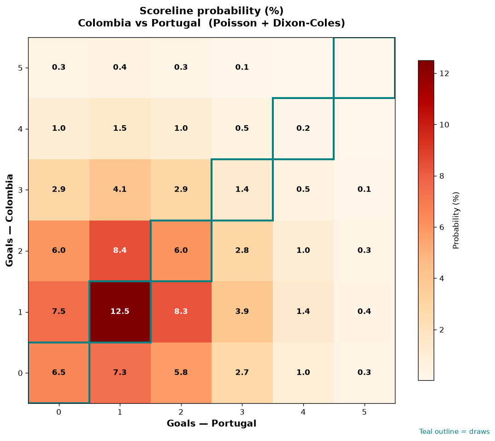

# Colombia vs Portugal — 2026-06-27

*Stage:* group  ·  *Engine:* Poisson bivariate + Dixon-Coles + Monte Carlo

## Expected goals (model)

- **Colombia**: 1.44
- **Portugal**: 1.42
- **Total**: 2.86  ·  rho = -0.0675

## 1X2 (match result)

| Outcome | Model |
|---|---|
| Colombia win | **37.2%** |
| Draw | **26.6%** |
| Portugal win | **36.2%** |

*Monte Carlo (50,000 sims):* 37.3% / 26.5% / 36.1% · avg goals 2.86

## Most likely scorelines

- 1-1: 12.5%
- 2-1: 8.4%
- 1-2: 8.3%
- 1-0: 7.5%
- 0-1: 7.3%
- 0-0: 6.5%

## Derived markets

- Both teams to score: 58.6%
- Over 2.5 goals: 54.4%  ·  Under 2.5: 45.6%
- Double chance 1X: 63.8%  ·  X2: 62.8%

## Scoreline heatmap

---
*Informational model output — not betting advice.*