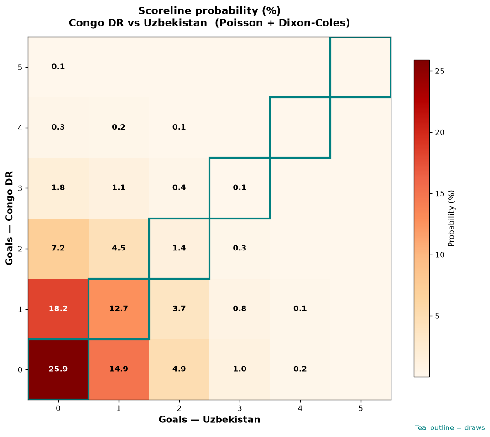

# Congo DR vs Uzbekistan — 2026-06-27

*Stage:* group  ·  *Engine:* Poisson bivariate + Dixon-Coles + Monte Carlo

## Expected goals (model)

- **Congo DR**: 0.76
- **Uzbekistan**: 0.63
- **Total**: 1.38  ·  rho = -0.0675

## 1X2 (match result)

| Outcome | Model |
|---|---|
| Congo DR win | **33.9%** |
| Draw | **40.1%** |
| Uzbekistan win | **26.0%** |

*Monte Carlo (50,000 sims):* 34.0% / 40.2% / 25.9% · avg goals 1.38

## Most likely scorelines

- 0-0: 25.9%
- 1-0: 18.2%
- 0-1: 14.9%
- 1-1: 12.7%
- 2-0: 7.2%
- 0-2: 4.9%

## Derived markets

- Both teams to score: 25.5%
- Over 2.5 goals: 16.2%  ·  Under 2.5: 83.8%
- Double chance 1X: 74.0%  ·  X2: 66.1%

## Scoreline heatmap

---
*Informational model output — not betting advice.*