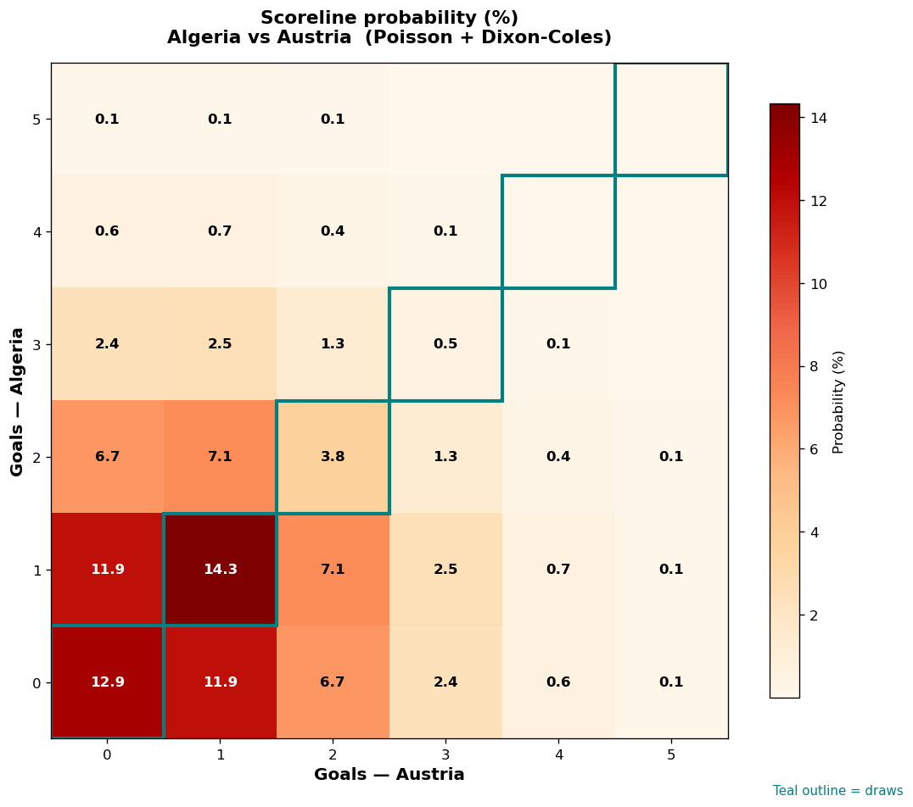

# Algeria vs Austria — 2026-06-28

*Stage:* group  ·  *Engine:* Poisson bivariate + Dixon-Coles + Monte Carlo

## Expected goals (model)

- **Algeria**: 1.06
- **Austria**: 1.06
- **Total**: 2.11  ·  rho = -0.0619

## 1X2 (match result)

| Outcome | Model |
|---|---|
| Algeria win | **34.2%** |
| Draw | **31.5%** |
| Austria win | **34.3%** |

*Monte Carlo (2,000 sims):* 35.5% / 30.3% / 34.2% · avg goals 2.11

## Most likely scorelines

- 1-1: 14.3%
- 0-0: 12.9%
- 0-1: 11.9%
- 1-0: 11.9%
- 1-2: 7.1%
- 2-1: 7.1%

## Derived markets

- Both teams to score: 43.4%
- Over 2.5 goals: 35.4%  ·  Under 2.5: 64.6%
- Double chance 1X: 65.7%  ·  X2: 65.8%

## Scoreline heatmap

---
*Informational model output — not betting advice.*