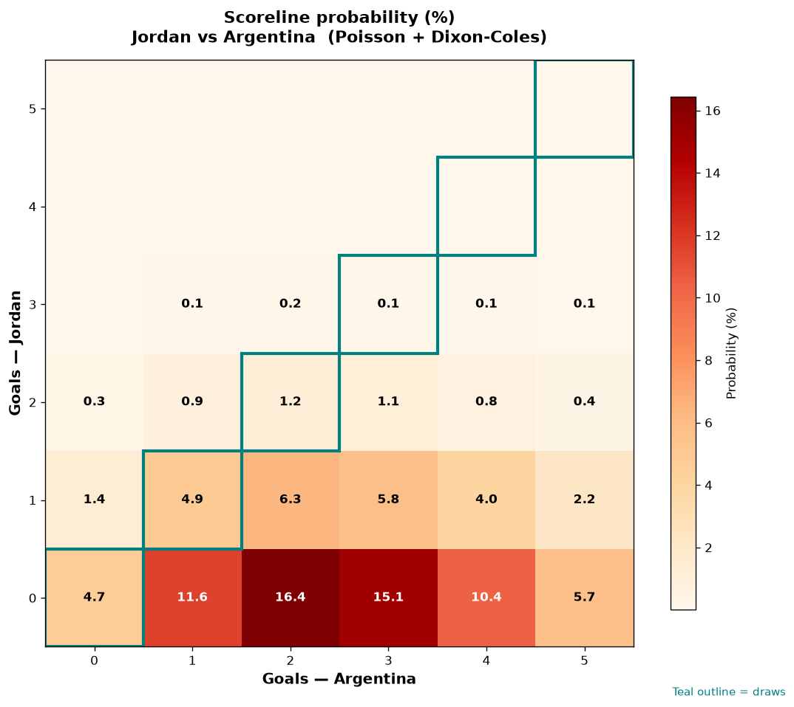

# Jordan vs Argentina — 2026-06-28

*Stage:* group  ·  *Engine:* Poisson bivariate + Dixon-Coles + Monte Carlo

## Expected goals (model)

- **Jordan**: 0.38
- **Argentina**: 2.75
- **Total**: 3.14  ·  rho = -0.0675

## 1X2 (match result)

| Outcome | Model |
|---|---|
| Jordan win | **2.9%** |
| Draw | **10.9%** |
| Argentina win | **86.1%** |

*Monte Carlo (50,000 sims):* 3.0% / 11.1% / 86.0% · avg goals 3.13

## Most likely scorelines

- 0-2: 16.4%
- 0-3: 15.1%
- 0-1: 11.6%
- 0-4: 10.4%
- 1-2: 6.3%
- 1-3: 5.8%

## Derived markets

- Both teams to score: 30.2%
- Over 2.5 goals: 60.7%  ·  Under 2.5: 39.3%
- Double chance 1X: 13.9%  ·  X2: 97.1%

## Scoreline heatmap

---
*Informational model output — not betting advice.*