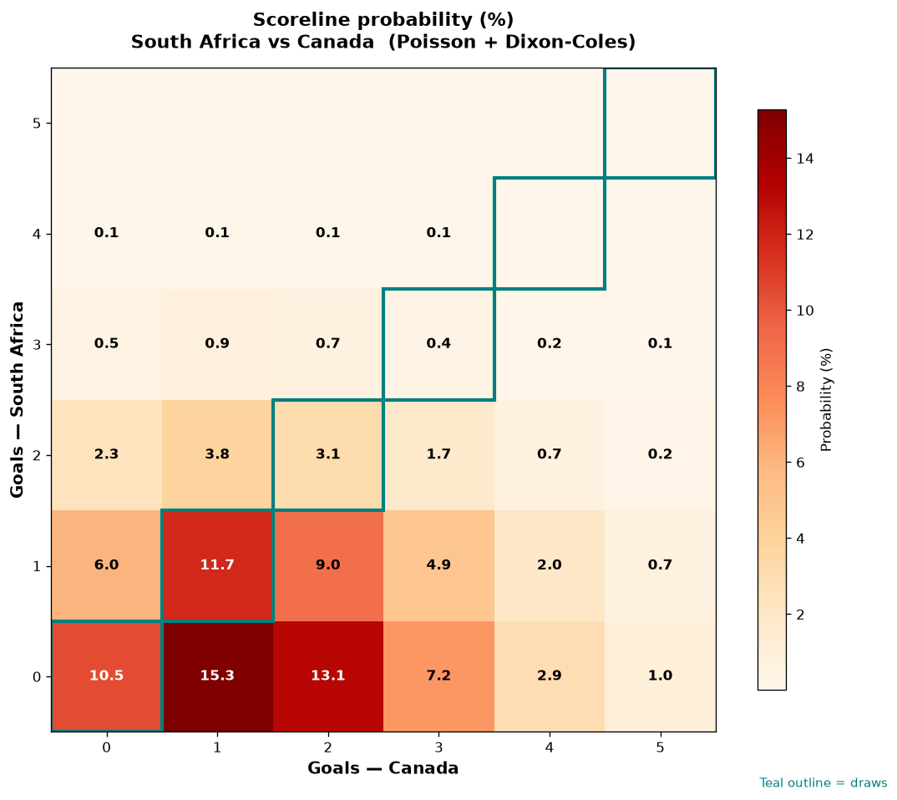

# South Africa vs Canada — 2026-06-28

*Stage:* round_of_32  ·  *Engine:* Poisson bivariate + Dixon-Coles + Monte Carlo

## Expected goals (model)

- **South Africa**: 0.69
- **Canada**: 1.64
- **Total**: 2.33  ·  rho = -0.065

## 1X2 (match result)

| Outcome | Model |
|---|---|
| South Africa win | **14.7%** |
| Draw | **25.7%** |
| Canada win | **59.7%** |

*Monte Carlo (50,000 sims):* 14.6% / 25.6% / 59.8% · avg goals 2.33

## Most likely scorelines

- 0-1: 15.3%
- 0-2: 13.1%
- 1-1: 11.7%
- 0-0: 10.5%
- 1-2: 9.0%
- 0-3: 7.2%

## Derived markets

- Both teams to score: 40.8%
- Over 2.5 goals: 41.1%  ·  Under 2.5: 58.9%
- Double chance 1X: 40.3%  ·  X2: 85.3%

## Knockout advancement (incl. extra time + penalties)

- **South Africa advances**: 24.6%
- **Canada advances**: 75.4%

## Scoreline heatmap

---
*Informational model output — not betting advice.*