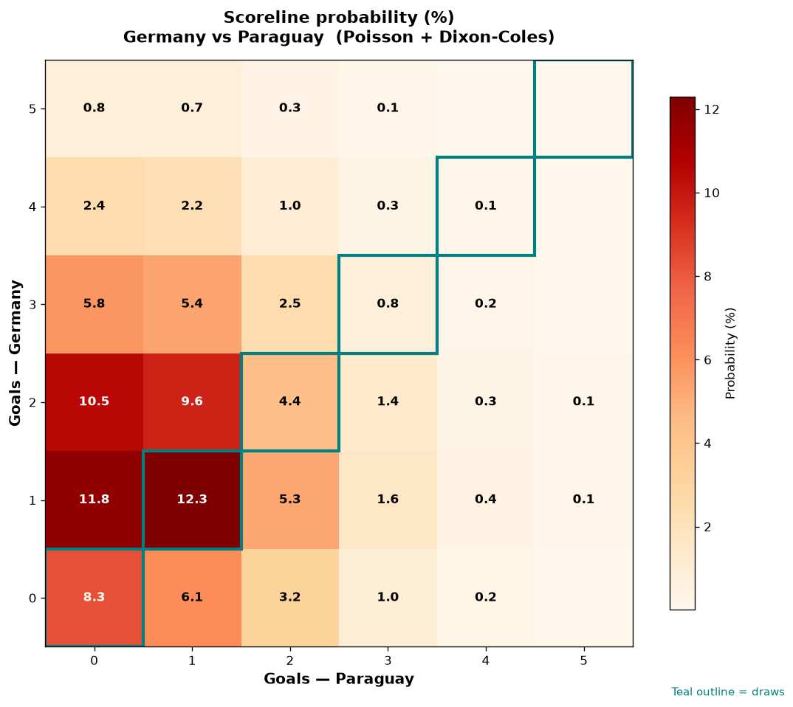

# Germany vs Paraguay — 2026-06-29

*Stage:* round_of_32  ·  *Engine:* Poisson bivariate + Dixon-Coles + Monte Carlo

## Expected goals (model)

- **Germany**: 1.67
- **Paraguay**: 0.92
- **Total**: 2.59  ·  rho = -0.068

## 1X2 (match result)

| Outcome | Model |
|---|---|
| Germany win | **54.4%** |
| Draw | **25.8%** |
| Paraguay win | **19.8%** |

*Monte Carlo (50,000 sims):* 54.5% / 25.8% / 19.7% · avg goals 2.59

## Most likely scorelines

- 1-1: 12.3%
- 1-0: 11.8%
- 2-0: 10.5%
- 2-1: 9.6%
- 0-0: 8.3%
- 0-1: 6.1%

## Derived markets

- Both teams to score: 49.5%
- Over 2.5 goals: 47.9%  ·  Under 2.5: 52.1%
- Double chance 1X: 80.2%  ·  X2: 45.6%

## Knockout advancement (incl. extra time + penalties)

- **Germany advances**: 69.6%
- **Paraguay advances**: 30.4%

## Scoreline heatmap

---
*Informational model output — not betting advice.*