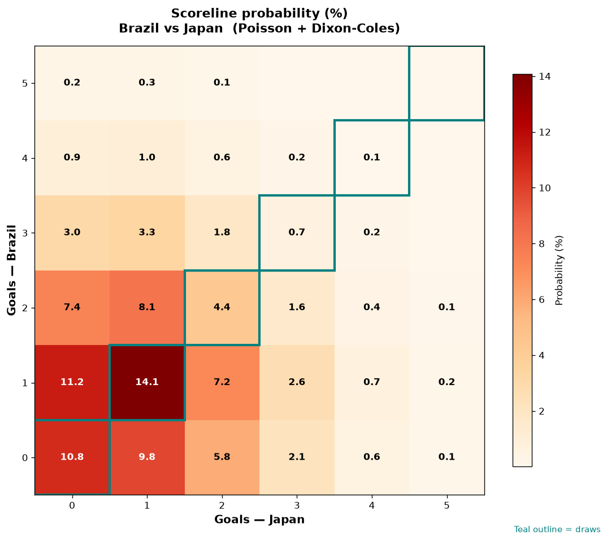

# Brazil vs Japan — 2026-06-29

*Stage:* round_of_32  ·  *Engine:* Poisson bivariate + Dixon-Coles + Monte Carlo

## Expected goals (model)

- **Brazil**: 1.23
- **Japan**: 1.09
- **Total**: 2.32  ·  rho = -0.068

## 1X2 (match result)

| Outcome | Model |
|---|---|
| Brazil win | **38.5%** |
| Draw | **30.0%** |
| Japan win | **31.5%** |

*Monte Carlo (50,000 sims):* 38.5% / 29.9% / 31.6% · avg goals 2.32

## Most likely scorelines

- 1-1: 14.1%
- 1-0: 11.2%
- 0-0: 10.8%
- 0-1: 9.8%
- 2-1: 8.1%
- 2-0: 7.4%

## Derived markets

- Both teams to score: 47.8%
- Over 2.5 goals: 40.8%  ·  Under 2.5: 59.2%
- Double chance 1X: 68.5%  ·  X2: 61.5%

## Knockout advancement (incl. extra time + penalties)

- **Brazil advances**: 54.0%
- **Japan advances**: 46.0%

## Scoreline heatmap

---
*Informational model output — not betting advice.*