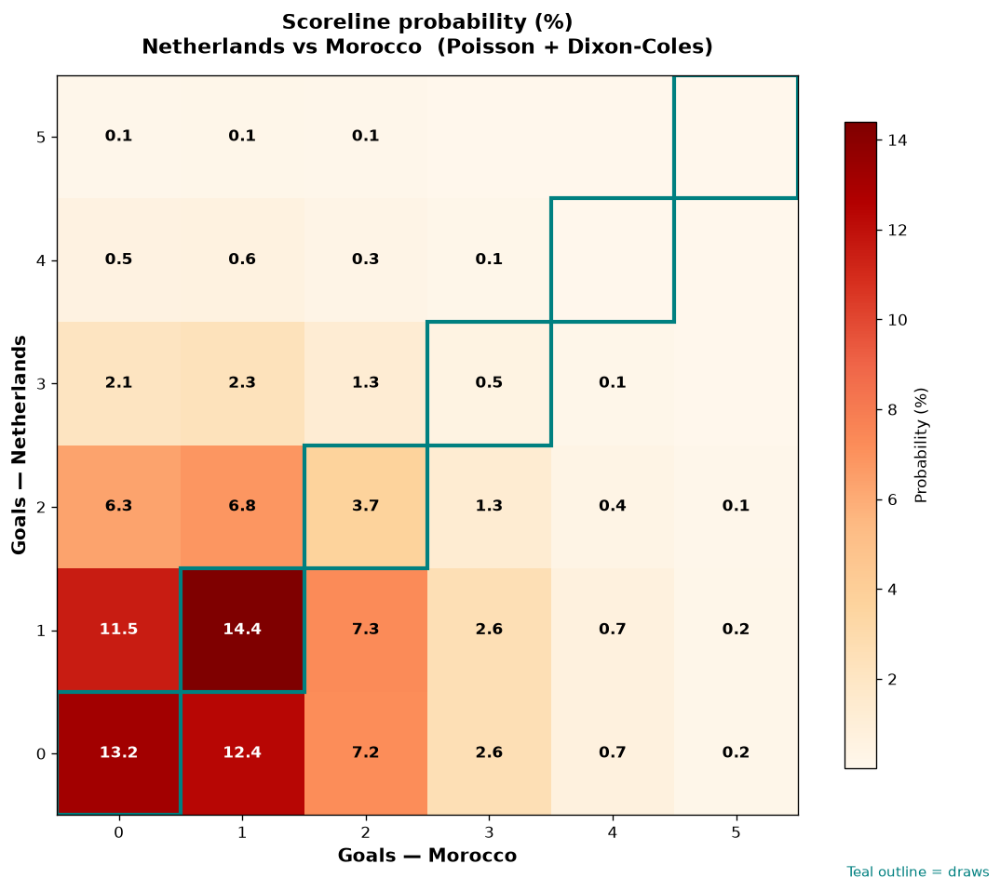

# Netherlands vs Morocco — 2026-06-30

*Stage:* round_of_32  ·  *Engine:* Poisson bivariate + Dixon-Coles + Monte Carlo

## Expected goals (model)

- **Netherlands**: 1.02
- **Morocco**: 1.08
- **Total**: 2.10  ·  rho = -0.068

## 1X2 (match result)

| Outcome | Model |
|---|---|
| Netherlands win | **32.4%** |
| Draw | **31.8%** |
| Morocco win | **35.9%** |

*Monte Carlo (50,000 sims):* 32.3% / 31.9% / 35.8% · avg goals 2.10

## Most likely scorelines

- 1-1: 14.4%
- 0-0: 13.2%
- 0-1: 12.4%
- 1-0: 11.5%
- 1-2: 7.3%
- 0-2: 7.2%

## Derived markets

- Both teams to score: 43.1%
- Over 2.5 goals: 35.0%  ·  Under 2.5: 65.0%
- Double chance 1X: 64.1%  ·  X2: 67.6%

## Knockout advancement (incl. extra time + penalties)

- **Netherlands advances**: 48.0%
- **Morocco advances**: 52.0%

## Scoreline heatmap

---
*Informational model output — not betting advice.*