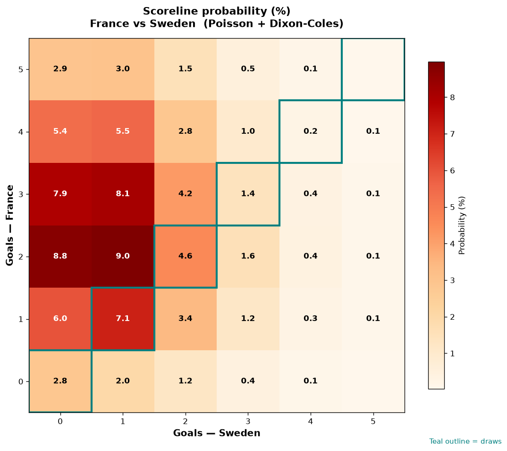

# France vs Sweden — 2026-06-30

*Stage:* round_of_32  ·  *Engine:* Poisson bivariate + Dixon-Coles + Monte Carlo

## Expected goals (model)

- **France**: 2.72
- **Sweden**: 1.02
- **Total**: 3.74  ·  rho = -0.0696

## 1X2 (match result)

| Outcome | Model |
|---|---|
| France win | **72.5%** |
| Draw | **16.2%** |
| Sweden win | **11.3%** |

*Monte Carlo (50,000 sims):* 72.7% / 16.1% / 11.2% · avg goals 3.74

## Most likely scorelines

- 2-1: 9.0%
- 2-0: 8.8%
- 3-1: 8.1%
- 3-0: 7.9%
- 1-1: 7.1%
- 1-0: 6.0%

## Derived markets

- Both teams to score: 60.3%
- Over 2.5 goals: 72.1%  ·  Under 2.5: 27.9%
- Double chance 1X: 88.7%  ·  X2: 27.5%

## Knockout advancement (incl. extra time + penalties)

- **France advances**: 83.5%
- **Sweden advances**: 16.5%

## Scoreline heatmap

---
*Informational model output — not betting advice.*