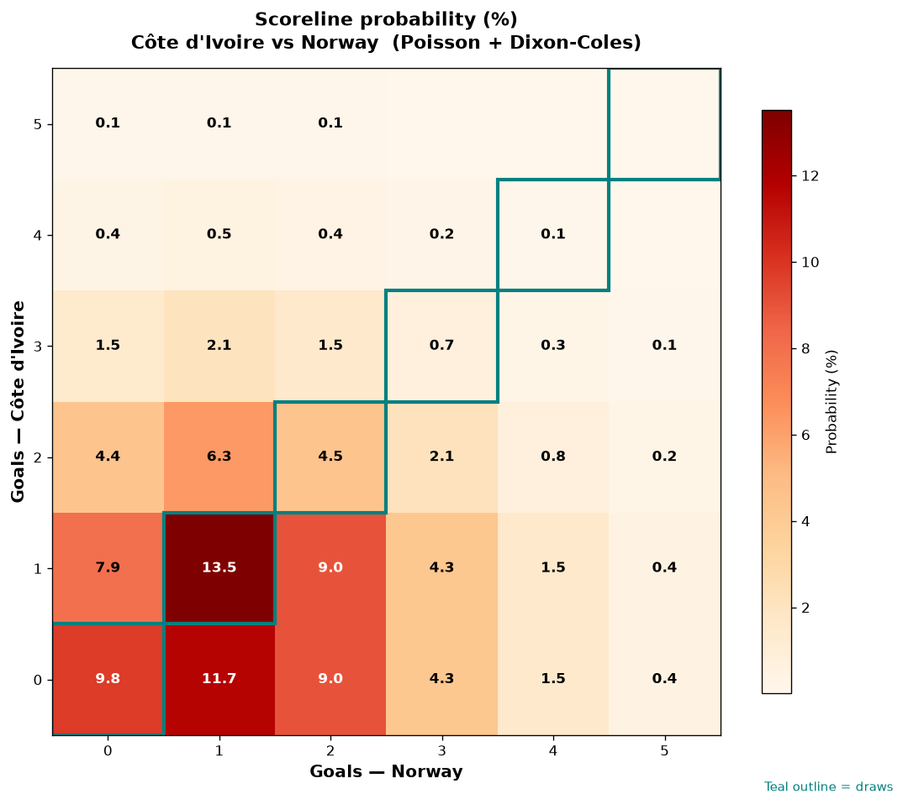

# Côte d'Ivoire vs Norway — 2026-06-30

*Stage:* round_of_32  ·  *Engine:* Poisson bivariate + Dixon-Coles + Monte Carlo

## Expected goals (model)

- **Côte d'Ivoire**: 1.00
- **Norway**: 1.43
- **Total**: 2.43  ·  rho = -0.0726

## 1X2 (match result)

| Outcome | Model |
|---|---|
| Côte d'Ivoire win | **25.5%** |
| Draw | **28.5%** |
| Norway win | **45.9%** |

*Monte Carlo (50,000 sims):* 25.6% / 28.4% / 46.0% · avg goals 2.43

## Most likely scorelines

- 1-1: 13.5%
- 0-1: 11.7%
- 0-0: 9.8%
- 0-2: 9.0%
- 1-2: 9.0%
- 1-0: 7.9%

## Derived markets

- Both teams to score: 48.9%
- Over 2.5 goals: 43.7%  ·  Under 2.5: 56.3%
- Double chance 1X: 54.1%  ·  X2: 74.5%

## Knockout advancement (incl. extra time + penalties)

- **Côte d'Ivoire advances**: 38.3%
- **Norway advances**: 61.7%

## Scoreline heatmap

---
*Informational model output — not betting advice.*