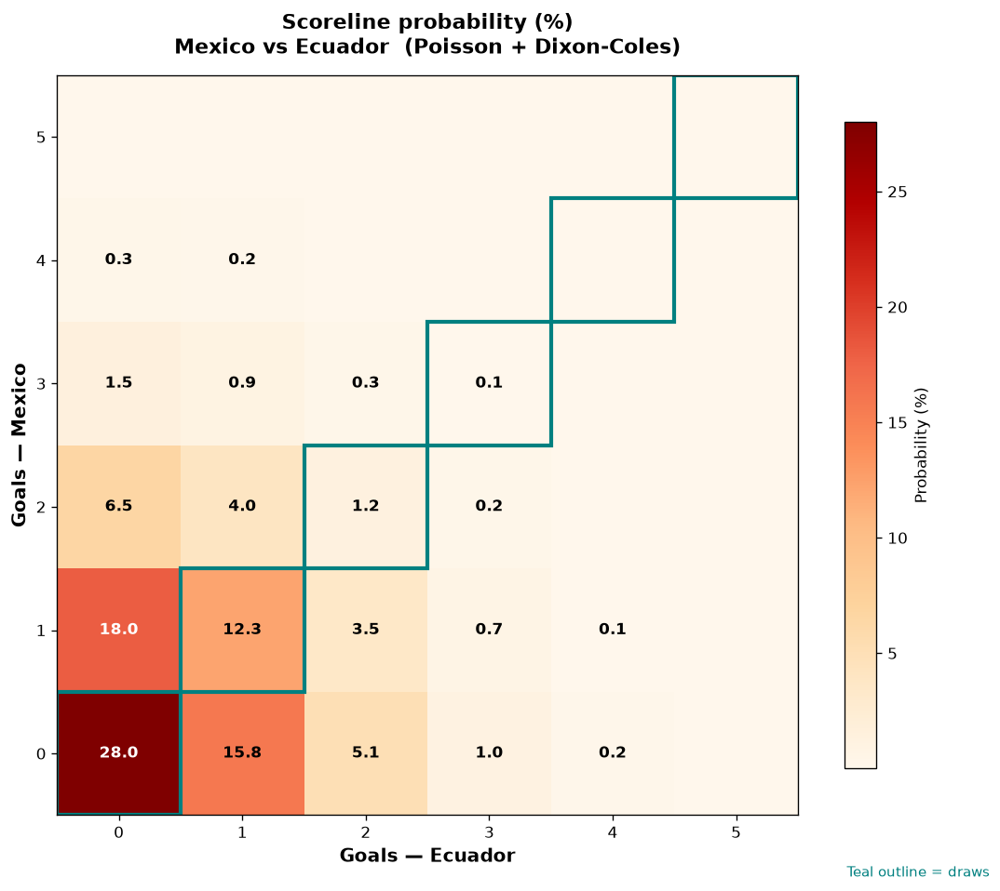

# Mexico vs Ecuador — 2026-07-01

*Stage:* round_of_32  ·  *Engine:* Poisson bivariate + Dixon-Coles + Monte Carlo

## Expected goals (model)

- **Mexico**: 0.69
- **Ecuador**: 0.61
- **Total**: 1.30  ·  rho = -0.068

## 1X2 (match result)

| Outcome | Model |
|---|---|
| Mexico win | **31.7%** |
| Draw | **41.5%** |
| Ecuador win | **26.7%** |

*Monte Carlo (50,000 sims):* 31.7% / 41.9% / 26.4% · avg goals 1.30

## Most likely scorelines

- 0-0: 28.0%
- 1-0: 18.0%
- 0-1: 15.8%
- 1-1: 12.3%
- 2-0: 6.5%
- 0-2: 5.1%

## Derived markets

- Both teams to score: 23.5%
- Over 2.5 goals: 14.3%  ·  Under 2.5: 85.7%
- Double chance 1X: 73.3%  ·  X2: 68.3%

## Knockout advancement (incl. extra time + penalties)

- **Mexico advances**: 53.0%
- **Ecuador advances**: 47.0%

## Scoreline heatmap

---
*Informational model output — not betting advice.*