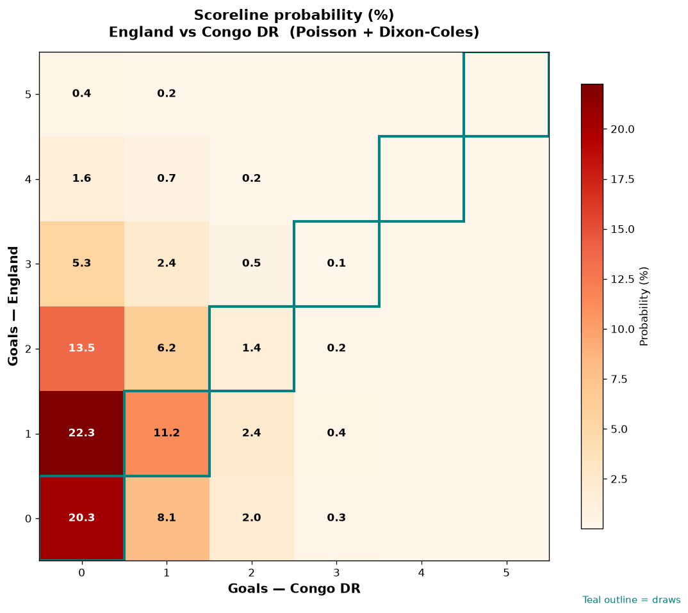

# England vs Congo DR — 2026-07-01

*Stage:* round_of_32  ·  *Engine:* Poisson bivariate + Dixon-Coles + Monte Carlo

## Expected goals (model)

- **England**: 1.18
- **Congo DR**: 0.45
- **Total**: 1.63  ·  rho = -0.0729

## 1X2 (match result)

| Outcome | Model |
|---|---|
| England win | **53.4%** |
| Draw | **33.1%** |
| Congo DR win | **13.5%** |

*Monte Carlo (50,000 sims):* 53.4% / 33.1% / 13.4% · avg goals 1.63

## Most likely scorelines

- 1-0: 22.3%
- 0-0: 20.3%
- 2-0: 13.5%
- 1-1: 11.2%
- 0-1: 8.1%
- 2-1: 6.2%

## Derived markets

- Both teams to score: 26.0%
- Over 2.5 goals: 22.5%  ·  Under 2.5: 77.5%
- Double chance 1X: 86.5%  ·  X2: 46.6%

## Knockout advancement (incl. extra time + penalties)

- **England advances**: 73.1%
- **Congo DR advances**: 26.9%

## Scoreline heatmap

---
*Informational model output — not betting advice.*