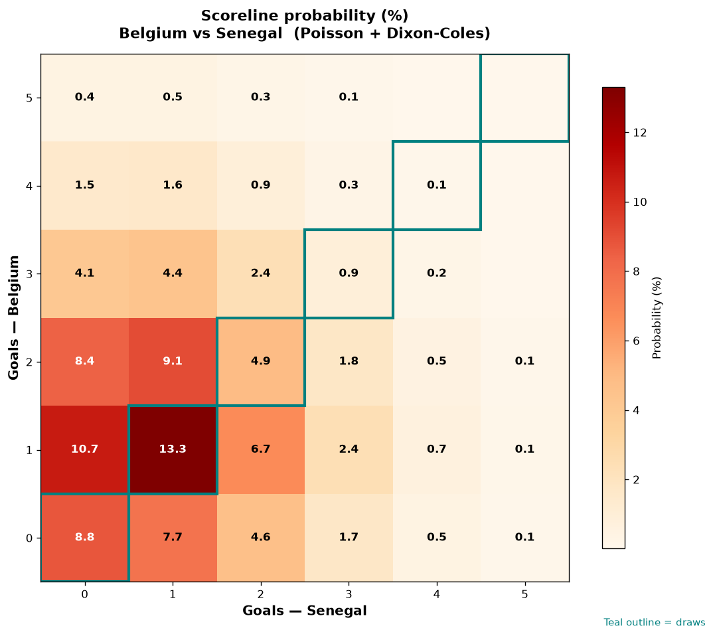

# Belgium vs Senegal — 2026-07-01

*Stage:* round_of_32  ·  *Engine:* Poisson bivariate + Dixon-Coles + Monte Carlo

## Expected goals (model)

- **Belgium**: 1.45
- **Senegal**: 1.08
- **Total**: 2.53  ·  rho = -0.068

## 1X2 (match result)

| Outcome | Model |
|---|---|
| Belgium win | **44.8%** |
| Draw | **27.9%** |
| Senegal win | **27.3%** |

*Monte Carlo (50,000 sims):* 45.0% / 27.7% / 27.3% · avg goals 2.53

## Most likely scorelines

- 1-1: 13.3%
- 1-0: 10.7%
- 2-1: 9.1%
- 0-0: 8.8%
- 2-0: 8.4%
- 0-1: 7.7%

## Derived markets

- Both teams to score: 51.5%
- Over 2.5 goals: 46.5%  ·  Under 2.5: 53.5%
- Double chance 1X: 72.7%  ·  X2: 55.2%

## Knockout advancement (incl. extra time + penalties)

- **Belgium advances**: 60.0%
- **Senegal advances**: 40.0%

## Scoreline heatmap

---
*Informational model output — not betting advice.*