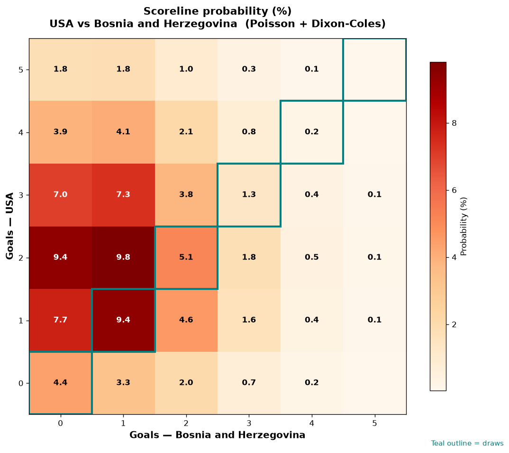

# USA vs Bosnia and Herzegovina — 2026-07-02

*Stage:* round_of_32  ·  *Engine:* Poisson bivariate + Dixon-Coles + Monte Carlo

## Expected goals (model)

- **USA**: 2.24
- **Bosnia and Herzegovina**: 1.05
- **Total**: 3.29  ·  rho = -0.0726

## 1X2 (match result)

| Outcome | Model |
|---|---|
| USA win | **63.7%** |
| Draw | **20.5%** |
| Bosnia and Herzegovina win | **15.9%** |

*Monte Carlo (50,000 sims):* 63.8% / 20.5% / 15.7% · avg goals 3.29

## Most likely scorelines

- 2-1: 9.8%
- 1-1: 9.4%
- 2-0: 9.4%
- 1-0: 7.7%
- 3-1: 7.3%
- 3-0: 7.0%

## Derived markets

- Both teams to score: 58.6%
- Over 2.5 goals: 63.8%  ·  Under 2.5: 36.2%
- Double chance 1X: 84.1%  ·  X2: 36.3%

## Knockout advancement (incl. extra time + penalties)

- **USA advances**: 76.5%
- **Bosnia and Herzegovina advances**: 23.5%

## Scoreline heatmap

---
*Informational model output — not betting advice.*