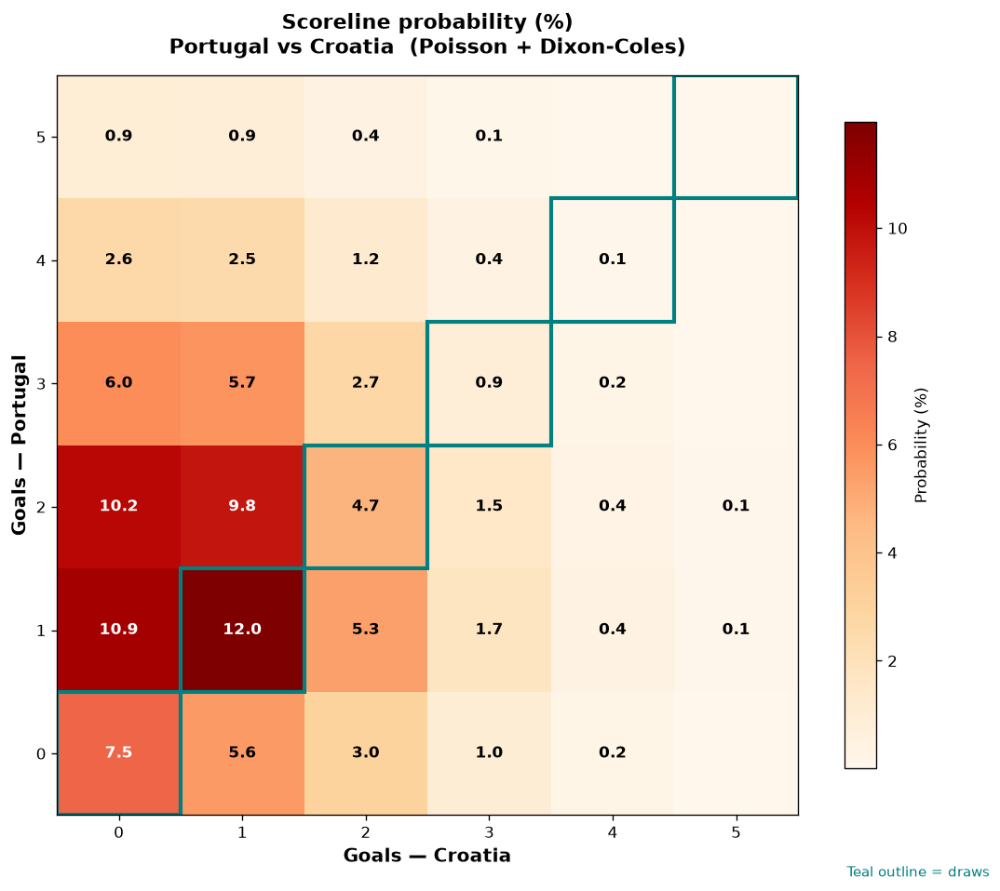

# Portugal vs Croatia — 2026-07-02

*Stage:* round_of_32  ·  *Engine:* Poisson bivariate + Dixon-Coles + Monte Carlo

## Expected goals (model)

- **Portugal**: 1.75
- **Croatia**: 0.96
- **Total**: 2.71  ·  rho = -0.0726

## 1X2 (match result)

| Outcome | Model |
|---|---|
| Portugal win | **55.3%** |
| Draw | **25.1%** |
| Croatia win | **19.6%** |

*Monte Carlo (50,000 sims):* 55.6% / 24.7% / 19.6% · avg goals 2.71

## Most likely scorelines

- 1-1: 12.0%
- 1-0: 10.9%
- 2-0: 10.2%
- 2-1: 9.8%
- 0-0: 7.5%
- 3-0: 6.0%

## Derived markets

- Both teams to score: 51.7%
- Over 2.5 goals: 50.9%  ·  Under 2.5: 49.1%
- Double chance 1X: 80.4%  ·  X2: 44.7%

## Knockout advancement (incl. extra time + penalties)

- **Portugal advances**: 70.2%
- **Croatia advances**: 29.8%

## Scoreline heatmap

---
*Informational model output — not betting advice.*