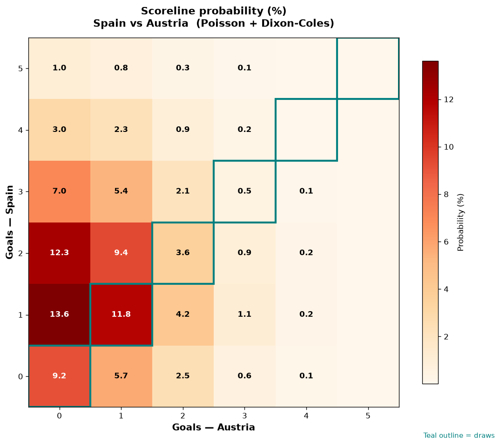

# Spain vs Austria — 2026-07-02

*Stage:* round_of_32  ·  *Engine:* Poisson bivariate + Dixon-Coles + Monte Carlo

## Expected goals (model)

- **Spain**: 1.71
- **Austria**: 0.77
- **Total**: 2.48  ·  rho = -0.068

## 1X2 (match result)

| Outcome | Model |
|---|---|
| Spain win | **59.1%** |
| Draw | **25.1%** |
| Austria win | **15.8%** |

*Monte Carlo (50,000 sims):* 59.3% / 25.1% / 15.6% · avg goals 2.48

## Most likely scorelines

- 1-0: 13.6%
- 2-0: 12.3%
- 1-1: 11.8%
- 2-1: 9.4%
- 0-0: 9.2%
- 3-0: 7.0%

## Derived markets

- Both teams to score: 44.6%
- Over 2.5 goals: 45.0%  ·  Under 2.5: 55.0%
- Double chance 1X: 84.2%  ·  X2: 40.9%

## Knockout advancement (incl. extra time + penalties)

- **Spain advances**: 74.5%
- **Austria advances**: 25.5%

## Scoreline heatmap

---
*Informational model output — not betting advice.*