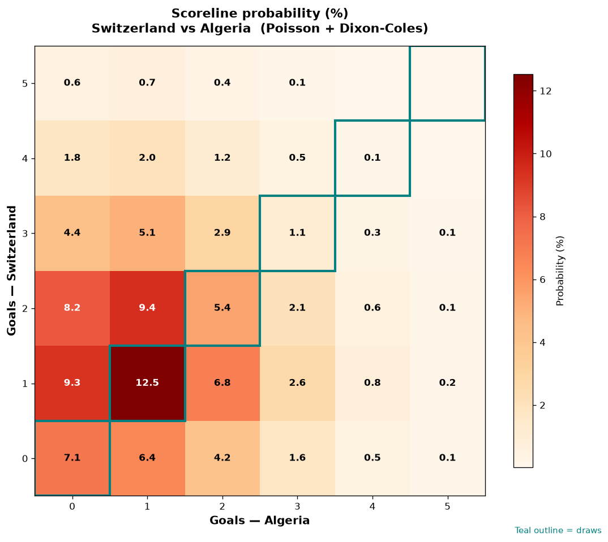

# Switzerland vs Algeria — 2026-07-03

*Stage:* round_of_32  ·  *Engine:* Poisson bivariate + Dixon-Coles + Monte Carlo

## Expected goals (model)

- **Switzerland**: 1.61
- **Algeria**: 1.16
- **Total**: 2.77  ·  rho = -0.0709

## 1X2 (match result)

| Outcome | Model |
|---|---|
| Switzerland win | **47.1%** |
| Draw | **26.4%** |
| Algeria win | **26.5%** |

*Monte Carlo (50,000 sims):* 47.3% / 26.4% / 26.3% · avg goals 2.77

## Most likely scorelines

- 1-1: 12.5%
- 2-1: 9.4%
- 1-0: 9.3%
- 2-0: 8.2%
- 0-0: 7.1%
- 1-2: 6.8%

## Derived markets

- Both teams to score: 55.7%
- Over 2.5 goals: 52.3%  ·  Under 2.5: 47.7%
- Double chance 1X: 73.5%  ·  X2: 52.9%

## Knockout advancement (incl. extra time + penalties)

- **Switzerland advances**: 61.7%
- **Algeria advances**: 38.3%

## Scoreline heatmap

---
*Informational model output — not betting advice.*