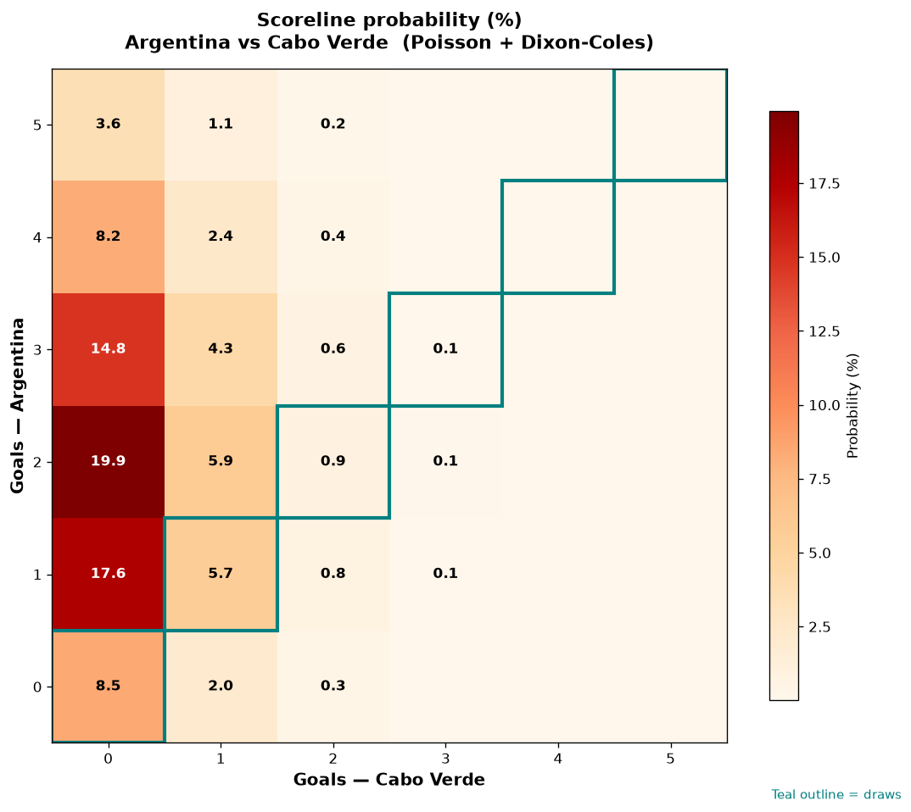

# Argentina vs Cabo Verde — 2026-07-03

*Stage:* round_of_32  ·  *Engine:* Poisson bivariate + Dixon-Coles + Monte Carlo

## Expected goals (model)

- **Argentina**: 2.22
- **Cabo Verde**: 0.29
- **Total**: 2.52  ·  rho = -0.0724

## 1X2 (match result)

| Outcome | Model |
|---|---|
| Argentina win | **81.6%** |
| Draw | **15.0%** |
| Cabo Verde win | **3.3%** |

*Monte Carlo (50,000 sims):* 81.8% / 14.9% / 3.3% · avg goals 2.52

## Most likely scorelines

- 2-0: 19.9%
- 1-0: 17.6%
- 3-0: 14.8%
- 0-0: 8.5%
- 4-0: 8.2%
- 2-1: 5.9%

## Derived markets

- Both teams to score: 23.1%
- Over 2.5 goals: 46.0%  ·  Under 2.5: 54.0%
- Double chance 1X: 96.7%  ·  X2: 18.4%

## Knockout advancement (incl. extra time + penalties)

- **Argentina advances**: 92.5%
- **Cabo Verde advances**: 7.5%

## Scoreline heatmap

---
*Informational model output — not betting advice.*