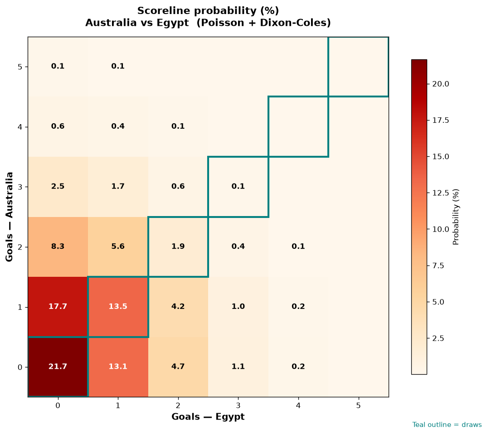

# Australia vs Egypt — 2026-07-03

*Stage:* round_of_32  ·  *Engine:* Poisson bivariate + Dixon-Coles + Monte Carlo

## Expected goals (model)

- **Australia**: 0.90
- **Egypt**: 0.67
- **Total**: 1.57  ·  rho = -0.0709

## 1X2 (match result)

| Outcome | Model |
|---|---|
| Australia win | **37.8%** |
| Draw | **37.2%** |
| Egypt win | **25.0%** |

*Monte Carlo (50,000 sims):* 37.8% / 37.2% / 25.0% · avg goals 1.57

## Most likely scorelines

- 0-0: 21.7%
- 1-0: 17.7%
- 1-1: 13.5%
- 0-1: 13.1%
- 2-0: 8.3%
- 2-1: 5.6%

## Derived markets

- Both teams to score: 29.9%
- Over 2.5 goals: 20.9%  ·  Under 2.5: 79.1%
- Double chance 1X: 75.0%  ·  X2: 62.2%

## Knockout advancement (incl. extra time + penalties)

- **Australia advances**: 57.5%
- **Egypt advances**: 42.5%

## Scoreline heatmap

---
*Informational model output — not betting advice.*