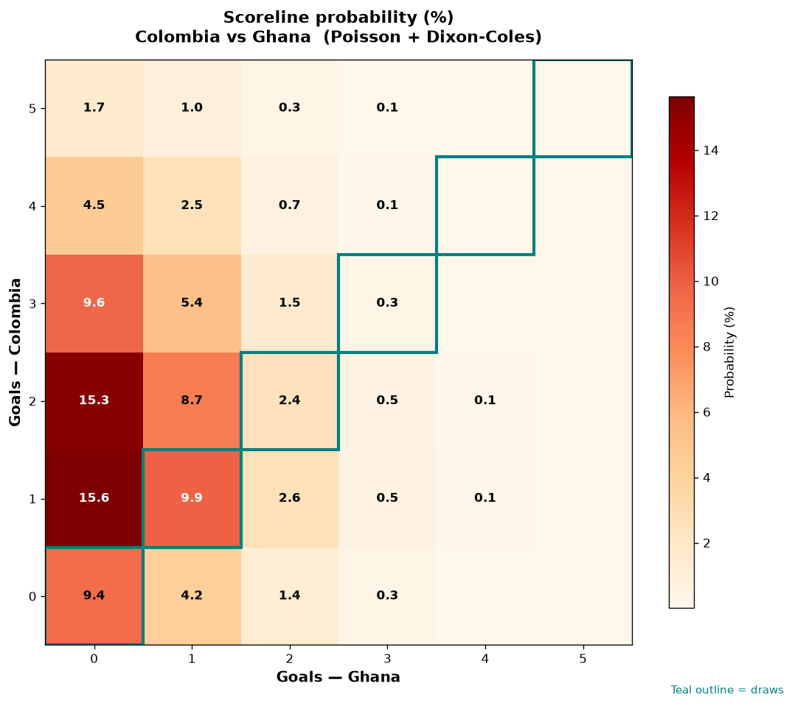

# Colombia vs Ghana — 2026-07-04

*Stage:* round_of_32  ·  *Engine:* Poisson bivariate + Dixon-Coles + Monte Carlo

## Expected goals (model)

- **Colombia**: 1.88
- **Ghana**: 0.57
- **Total**: 2.44  ·  rho = -0.0728

## 1X2 (match result)

| Outcome | Model |
|---|---|
| Colombia win | **68.3%** |
| Draw | **22.0%** |
| Ghana win | **9.7%** |

*Monte Carlo (50,000 sims):* 68.5% / 21.7% / 9.8% · avg goals 2.45

## Most likely scorelines

- 1-0: 15.6%
- 2-0: 15.3%
- 1-1: 9.9%
- 3-0: 9.6%
- 0-0: 9.4%
- 2-1: 8.7%

## Derived markets

- Both teams to score: 37.3%
- Over 2.5 goals: 44.2%  ·  Under 2.5: 55.8%
- Double chance 1X: 90.3%  ·  X2: 31.7%

## Knockout advancement (incl. extra time + penalties)

- **Colombia advances**: 82.7%
- **Ghana advances**: 17.3%

## Scoreline heatmap

---
*Informational model output — not betting advice.*