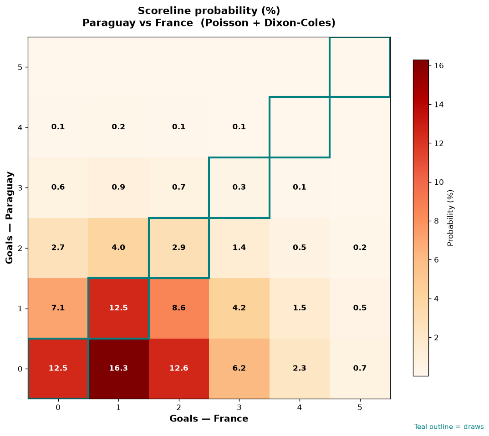

# Paraguay vs France — 2026-07-04

*Stage:* round_of_16  ·  *Engine:* Poisson bivariate + Dixon-Coles + Monte Carlo

## Expected goals (model)

- **Paraguay**: 0.68
- **France**: 1.47
- **Total**: 2.15  ·  rho = -0.0726

## 1X2 (match result)

| Outcome | Model |
|---|---|
| Paraguay win | **16.4%** |
| Draw | **28.2%** |
| France win | **55.4%** |

*Monte Carlo (50,000 sims):* 16.1% / 28.3% / 55.5% · avg goals 2.16

## Most likely scorelines

- 0-1: 16.3%
- 0-2: 12.6%
- 0-0: 12.5%
- 1-1: 12.5%
- 1-2: 8.6%
- 1-0: 7.1%

## Derived markets

- Both teams to score: 38.8%
- Over 2.5 goals: 36.3%  ·  Under 2.5: 63.7%
- Double chance 1X: 44.6%  ·  X2: 83.6%

## Knockout advancement (incl. extra time + penalties)

- **Paraguay advances**: 27.7%
- **France advances**: 72.3%

## Scoreline heatmap

---
*Informational model output — not betting advice.*