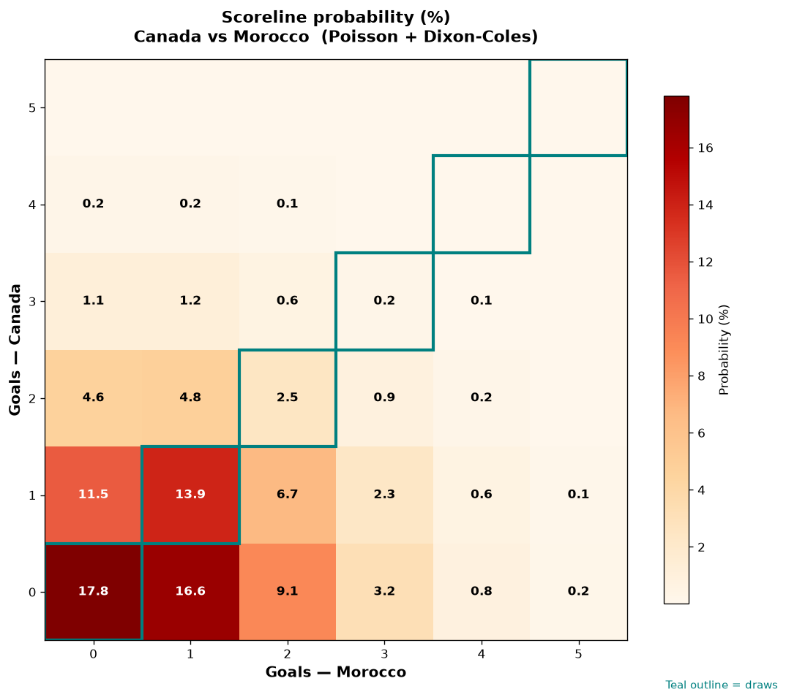

# Canada vs Morocco — 2026-07-04

*Stage:* round_of_16  ·  *Engine:* Poisson bivariate + Dixon-Coles + Monte Carlo

## Expected goals (model)

- **Canada**: 0.74
- **Morocco**: 1.04
- **Total**: 1.78  ·  rho = -0.0726

## 1X2 (match result)

| Outcome | Model |
|---|---|
| Canada win | **24.5%** |
| Draw | **34.5%** |
| Morocco win | **41.0%** |

*Monte Carlo (50,000 sims):* 24.5% / 34.7% / 40.8% · avg goals 1.78

## Most likely scorelines

- 0-0: 17.8%
- 0-1: 16.6%
- 1-1: 13.9%
- 1-0: 11.5%
- 0-2: 9.1%
- 1-2: 6.7%

## Derived markets

- Both teams to score: 34.7%
- Over 2.5 goals: 26.4%  ·  Under 2.5: 73.6%
- Double chance 1X: 59.0%  ·  X2: 75.5%

## Knockout advancement (incl. extra time + penalties)

- **Canada advances**: 40.4%
- **Morocco advances**: 59.6%

## Scoreline heatmap

---
*Informational model output — not betting advice.*