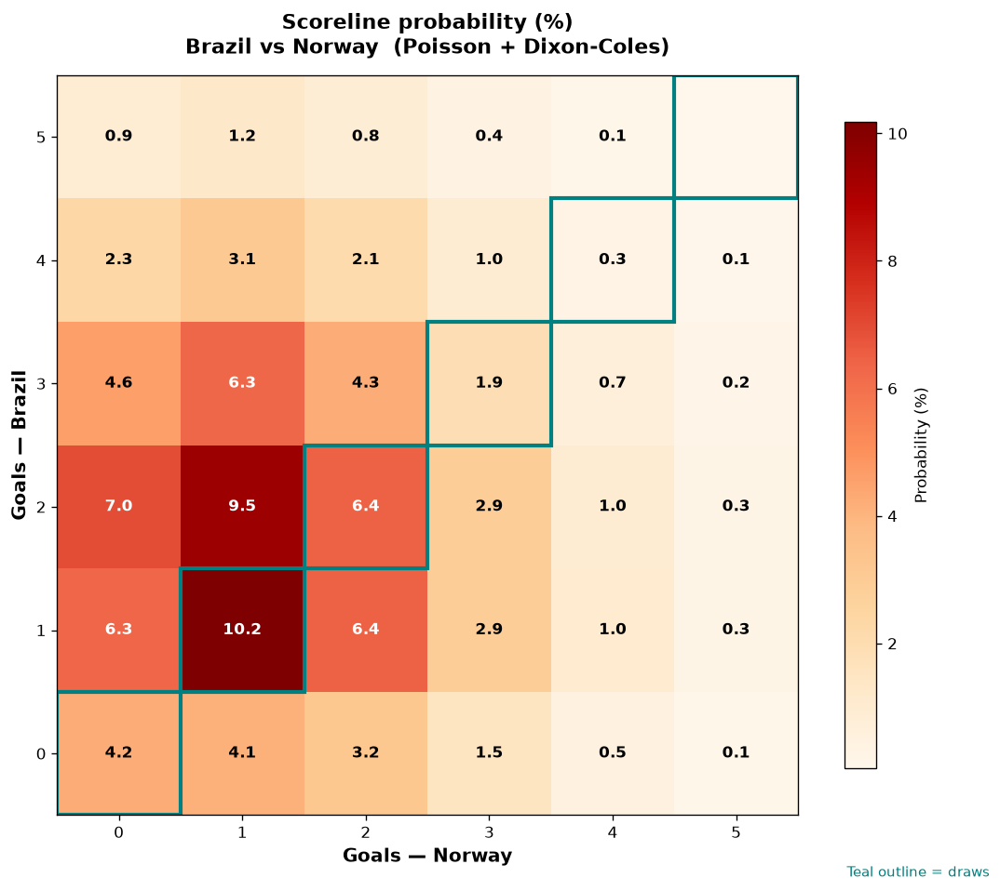

# Brazil vs Norway — 2026-07-05

*Stage:* round_of_16  ·  *Engine:* Poisson bivariate + Dixon-Coles + Monte Carlo

## Expected goals (model)

- **Brazil**: 1.99
- **Norway**: 1.36
- **Total**: 3.35  ·  rho = -0.0724

## 1X2 (match result)

| Outcome | Model |
|---|---|
| Brazil win | **51.5%** |
| Draw | **23.1%** |
| Norway win | **25.4%** |

*Monte Carlo (50,000 sims):* 51.6% / 23.2% / 25.1% · avg goals 3.35

## Most likely scorelines

- 1-1: 10.2%
- 2-1: 9.5%
- 2-0: 7.0%
- 1-2: 6.4%
- 2-2: 6.4%
- 1-0: 6.3%

## Derived markets

- Both teams to score: 64.8%
- Over 2.5 goals: 65.0%  ·  Under 2.5: 35.0%
- Double chance 1X: 74.6%  ·  X2: 48.5%

## Knockout advancement (incl. extra time + penalties)

- **Brazil advances**: 64.6%
- **Norway advances**: 35.4%

## Scoreline heatmap

---
*Informational model output — not betting advice.*