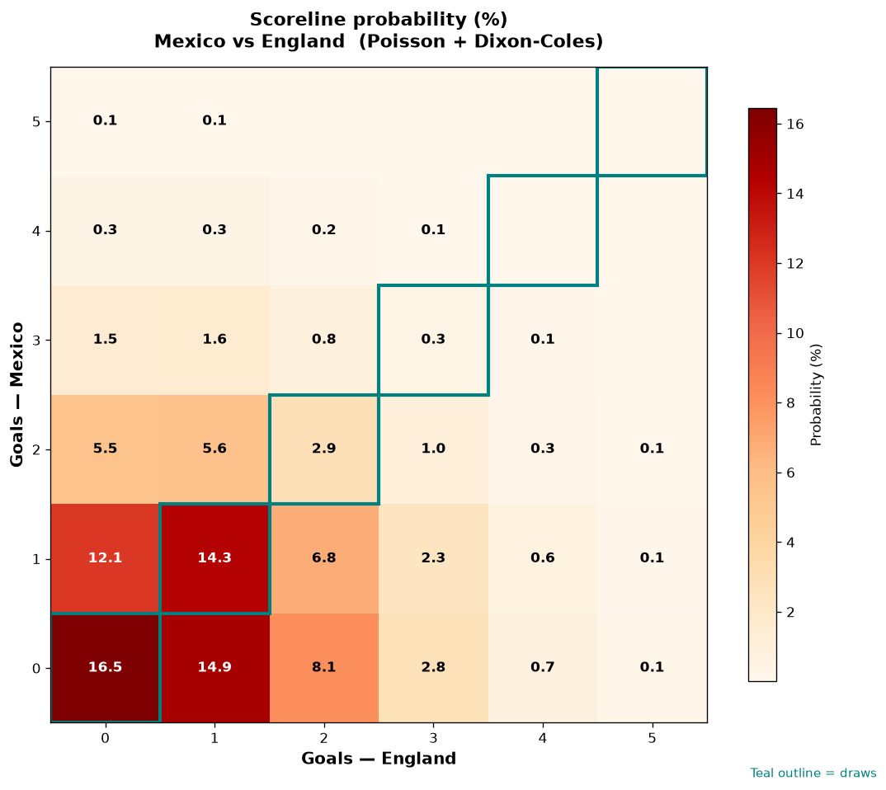

# Mexico vs England — 2026-07-06

*Stage:* round_of_16  ·  *Engine:* Poisson bivariate + Dixon-Coles + Monte Carlo

## Expected goals (model)

- **Mexico**: 0.84
- **England**: 1.02
- **Total**: 1.87  ·  rho = -0.0728

## 1X2 (match result)

| Outcome | Model |
|---|---|
| Mexico win | **28.2%** |
| Draw | **33.9%** |
| England win | **37.9%** |

*Monte Carlo (50,000 sims):* 28.1% / 34.0% / 37.9% · avg goals 1.87

## Most likely scorelines

- 0-0: 16.5%
- 0-1: 14.9%
- 1-1: 14.3%
- 1-0: 12.1%
- 0-2: 8.1%
- 1-2: 6.8%

## Derived markets

- Both teams to score: 37.4%
- Over 2.5 goals: 28.7%  ·  Under 2.5: 71.3%
- Double chance 1X: 62.1%  ·  X2: 71.8%

## Knockout advancement (incl. extra time + penalties)

- **Mexico advances**: 44.3%
- **England advances**: 55.7%

## Scoreline heatmap

---
*Informational model output — not betting advice.*