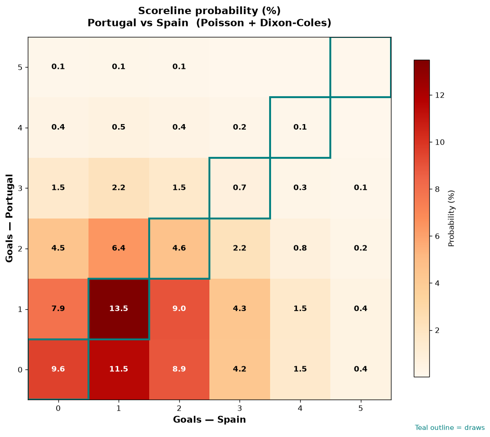

# Portugal vs Spain — 2026-07-06

*Stage:* round_of_16  ·  *Engine:* Poisson bivariate + Dixon-Coles + Monte Carlo

## Expected goals (model)

- **Portugal**: 1.01
- **Spain**: 1.43
- **Total**: 2.44  ·  rho = -0.0724

## 1X2 (match result)

| Outcome | Model |
|---|---|
| Portugal win | **25.8%** |
| Draw | **28.5%** |
| Spain win | **45.7%** |

*Monte Carlo (50,000 sims):* 26.0% / 28.1% / 45.8% · avg goals 2.45

## Most likely scorelines

- 1-1: 13.5%
- 0-1: 11.5%
- 0-0: 9.6%
- 1-2: 9.0%
- 0-2: 8.9%
- 1-0: 7.9%

## Derived markets

- Both teams to score: 49.4%
- Over 2.5 goals: 44.2%  ·  Under 2.5: 55.8%
- Double chance 1X: 54.3%  ·  X2: 74.2%

## Knockout advancement (incl. extra time + penalties)

- **Portugal advances**: 38.7%
- **Spain advances**: 61.3%

## Scoreline heatmap

---
*Informational model output — not betting advice.*