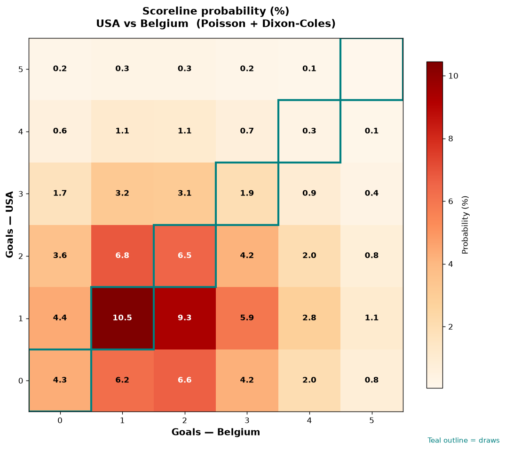

# USA vs Belgium — 2026-07-07

*Stage:* round_of_16  ·  *Engine:* Poisson bivariate + Dixon-Coles + Monte Carlo

## Expected goals (model)

- **USA**: 1.40
- **Belgium**: 1.91
- **Total**: 3.32  ·  rho = -0.0724

## 1X2 (match result)

| Outcome | Model |
|---|---|
| USA win | **27.6%** |
| Draw | **23.6%** |
| Belgium win | **48.8%** |

*Monte Carlo (50,000 sims):* 27.7% / 23.5% / 48.8% · avg goals 3.32

## Most likely scorelines

- 1-1: 10.5%
- 1-2: 9.3%
- 2-1: 6.8%
- 0-2: 6.6%
- 2-2: 6.5%
- 0-1: 6.2%

## Derived markets

- Both teams to score: 65.0%
- Over 2.5 goals: 64.4%  ·  Under 2.5: 35.6%
- Double chance 1X: 51.2%  ·  X2: 72.4%

## Knockout advancement (incl. extra time + penalties)

- **USA advances**: 38.1%
- **Belgium advances**: 61.9%

## Scoreline heatmap

---
*Informational model output — not betting advice.*