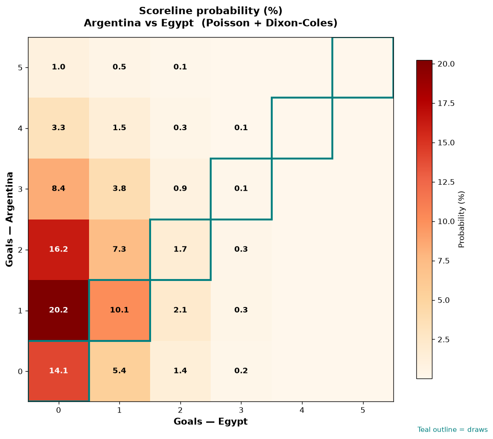

# Argentina vs Egypt — 2026-07-07

*Stage:* round_of_16  ·  *Engine:* Poisson bivariate + Dixon-Coles + Monte Carlo

## Expected goals (model)

- **Argentina**: 1.55
- **Egypt**: 0.45
- **Total**: 2.01  ·  rho = -0.0694

## 1X2 (match result)

| Outcome | Model |
|---|---|
| Argentina win | **64.2%** |
| Draw | **26.0%** |
| Egypt win | **9.8%** |

*Monte Carlo (50,000 sims):* 64.0% / 26.0% / 9.9% · avg goals 2.01

## Most likely scorelines

- 1-0: 20.2%
- 2-0: 16.2%
- 0-0: 14.1%
- 1-1: 10.1%
- 3-0: 8.4%
- 2-1: 7.3%

## Derived markets

- Both teams to score: 29.4%
- Over 2.5 goals: 32.5%  ·  Under 2.5: 67.5%
- Double chance 1X: 90.2%  ·  X2: 35.8%

## Knockout advancement (incl. extra time + penalties)

- **Argentina advances**: 80.7%
- **Egypt advances**: 19.3%

## Scoreline heatmap

---
*Informational model output — not betting advice.*