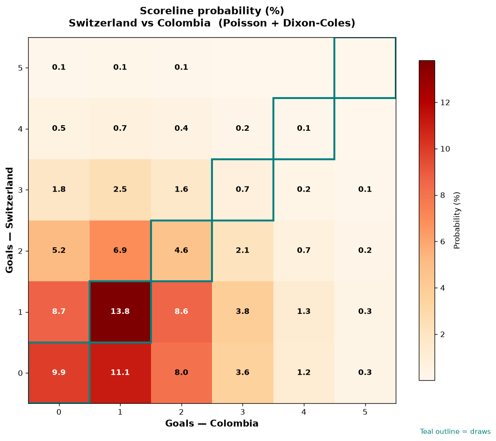

# Switzerland vs Colombia — 2026-07-07

*Stage:* round_of_16  ·  *Engine:* Poisson bivariate + Dixon-Coles + Monte Carlo

## Expected goals (model)

- **Switzerland**: 1.07
- **Colombia**: 1.34
- **Total**: 2.41  ·  rho = -0.0724

## 1X2 (match result)

| Outcome | Model |
|---|---|
| Switzerland win | **29.0%** |
| Draw | **29.1%** |
| Colombia win | **41.9%** |

*Monte Carlo (50,000 sims):* 29.2% / 28.9% / 41.8% · avg goals 2.41

## Most likely scorelines

- 1-1: 13.8%
- 0-1: 11.1%
- 0-0: 9.9%
- 1-0: 8.7%
- 1-2: 8.6%
- 0-2: 8.0%

## Derived markets

- Both teams to score: 49.4%
- Over 2.5 goals: 43.3%  ·  Under 2.5: 56.7%
- Double chance 1X: 58.1%  ·  X2: 71.0%

## Knockout advancement (incl. extra time + penalties)

- **Switzerland advances**: 42.6%
- **Colombia advances**: 57.4%

## Scoreline heatmap

---
*Informational model output — not betting advice.*