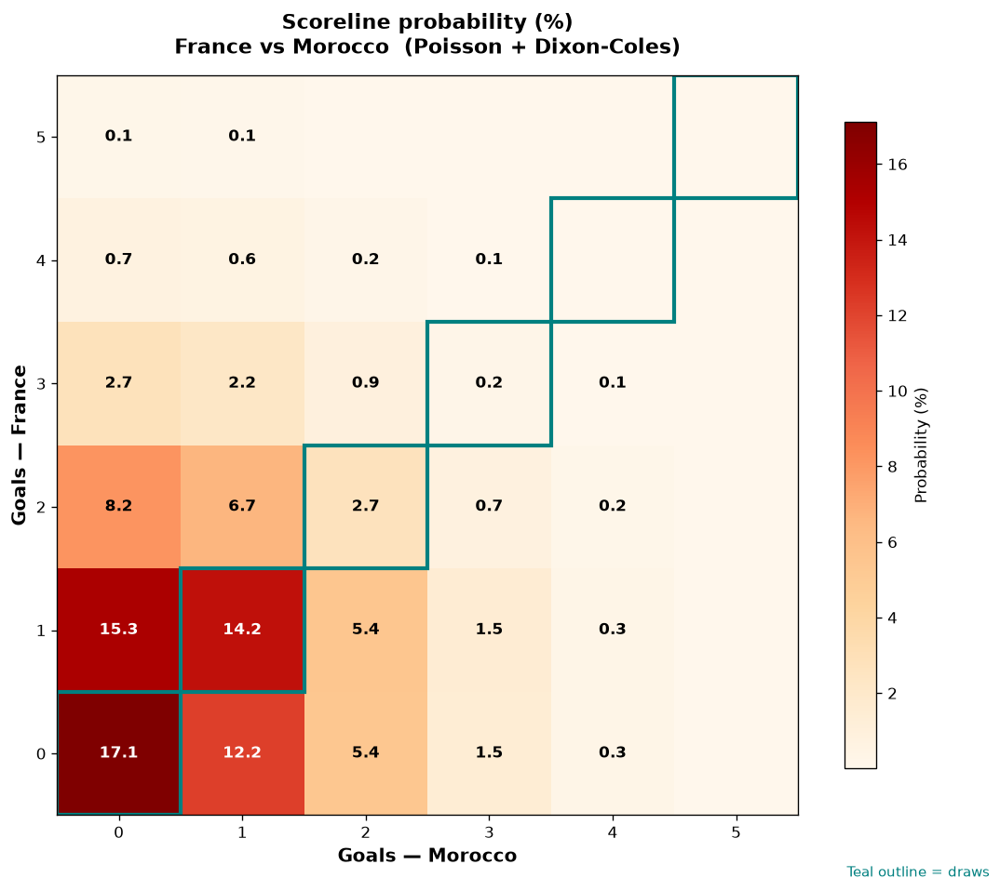

# France vs Morocco — 2026-07-09

*Stage:* quarter  ·  *Engine:* Poisson bivariate + Dixon-Coles + Monte Carlo

## Expected goals (model)

- **France**: 1.01
- **Morocco**: 0.82
- **Total**: 1.82  ·  rho = -0.0724

## 1X2 (match result)

| Outcome | Model |
|---|---|
| France win | **38.0%** |
| Draw | **34.3%** |
| Morocco win | **27.7%** |

*Monte Carlo (50,000 sims):* 38.1% / 34.5% / 27.5% · avg goals 1.82

## Most likely scorelines

- 0-0: 17.1%
- 1-0: 15.3%
- 1-1: 14.2%
- 0-1: 12.2%
- 2-0: 8.2%
- 2-1: 6.7%

## Derived markets

- Both teams to score: 36.4%
- Over 2.5 goals: 27.5%  ·  Under 2.5: 72.5%
- Double chance 1X: 72.3%  ·  X2: 62.0%

## Knockout advancement (incl. extra time + penalties)

- **France advances**: 56.0%
- **Morocco advances**: 44.0%

## Scoreline heatmap

---
*Informational model output — not betting advice.*