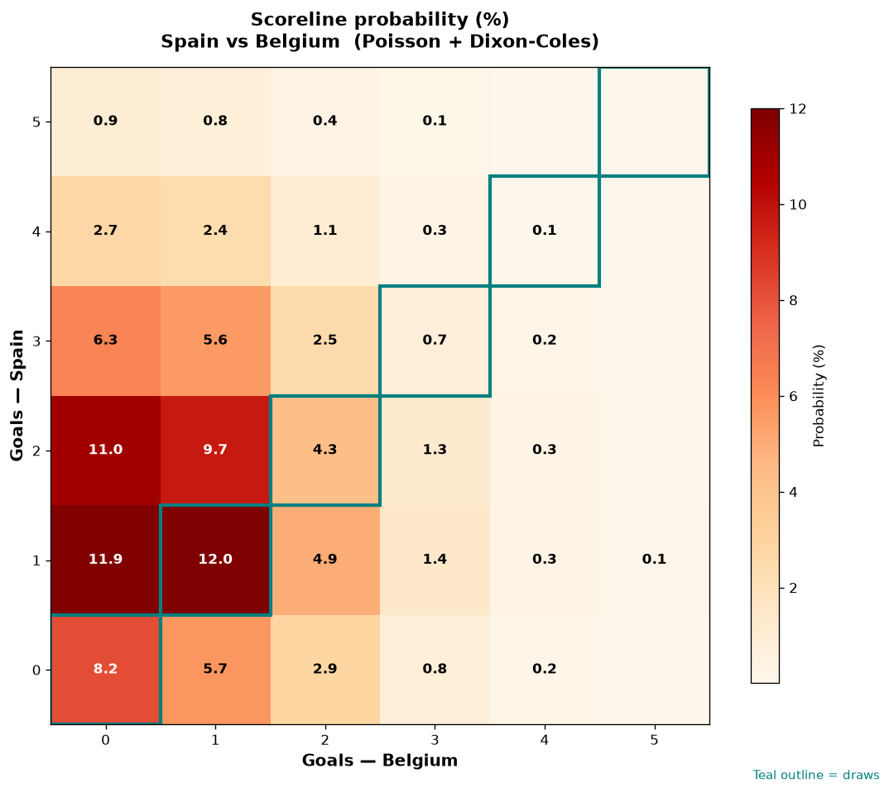

# Spain vs Belgium — 2026-07-10

*Stage:* quarter  ·  *Engine:* Poisson bivariate + Dixon-Coles + Monte Carlo

## Expected goals (model)

- **Spain**: 1.73
- **Belgium**: 0.88
- **Total**: 2.61  ·  rho = -0.0704

## 1X2 (match result)

| Outcome | Model |
|---|---|
| Spain win | **56.6%** |
| Draw | **25.2%** |
| Belgium win | **18.2%** |

*Monte Carlo (50,000 sims):* 56.8% / 25.1% / 18.1% · avg goals 2.61

## Most likely scorelines

- 1-1: 12.0%
- 1-0: 11.9%
- 2-0: 11.0%
- 2-1: 9.7%
- 0-0: 8.2%
- 3-0: 6.3%

## Derived markets

- Both teams to score: 48.9%
- Over 2.5 goals: 48.3%  ·  Under 2.5: 51.7%
- Double chance 1X: 81.8%  ·  X2: 43.4%

## Knockout advancement (incl. extra time + penalties)

- **Spain advances**: 71.7%
- **Belgium advances**: 28.3%

## Scoreline heatmap

---
*Informational model output — not betting advice.*