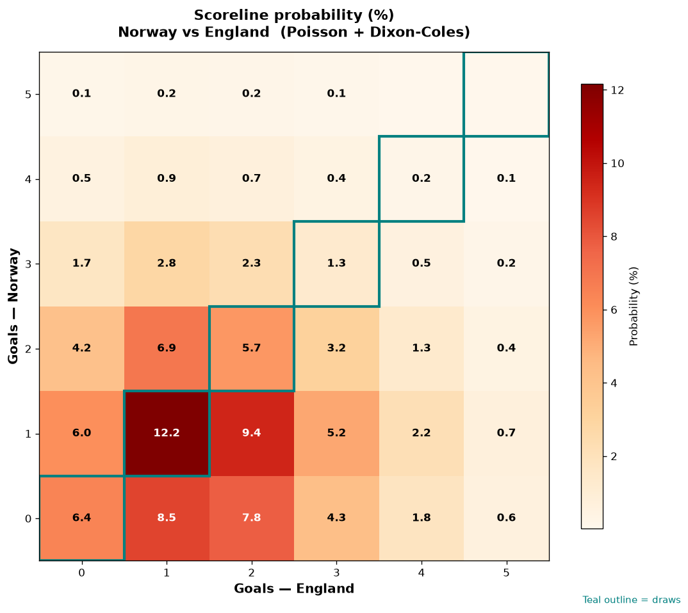

# Norway vs England — 2026-07-11

*Stage:* quarter  ·  *Engine:* Poisson bivariate + Dixon-Coles + Monte Carlo

## Expected goals (model)

- **Norway**: 1.22
- **England**: 1.66
- **Total**: 2.88  ·  rho = -0.0704

## 1X2 (match result)

| Outcome | Model |
|---|---|
| Norway win | **27.2%** |
| Draw | **25.8%** |
| England win | **47.0%** |

*Monte Carlo (50,000 sims):* 27.2% / 25.7% / 47.2% · avg goals 2.89

## Most likely scorelines

- 1-1: 12.2%
- 1-2: 9.4%
- 0-1: 8.5%
- 0-2: 7.8%
- 2-1: 6.9%
- 0-0: 6.4%

## Derived markets

- Both teams to score: 57.8%
- Over 2.5 goals: 54.9%  ·  Under 2.5: 45.1%
- Double chance 1X: 53.0%  ·  X2: 72.8%

## Knockout advancement (incl. extra time + penalties)

- **Norway advances**: 38.8%
- **England advances**: 61.2%

## Scoreline heatmap

---
*Informational model output — not betting advice.*