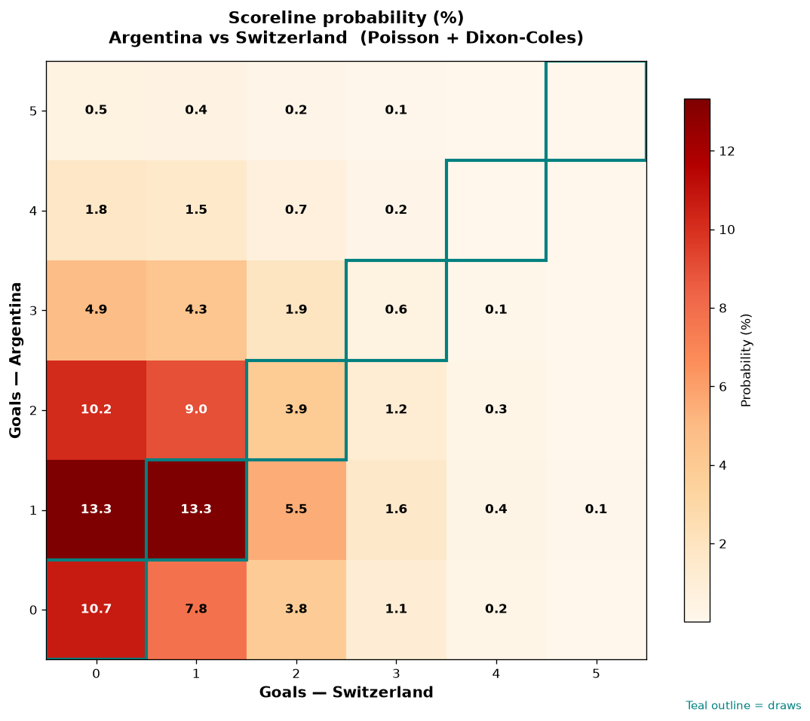

# Argentina vs Switzerland — 2026-07-12

*Stage:* quarter  ·  *Engine:* Poisson bivariate + Dixon-Coles + Monte Carlo

## Expected goals (model)

- **Argentina**: 1.44
- **Switzerland**: 0.88
- **Total**: 2.32  ·  rho = -0.0704

## 1X2 (match result)

| Outcome | Model |
|---|---|
| Argentina win | **49.3%** |
| Draw | **28.6%** |
| Switzerland win | **22.1%** |

*Monte Carlo (50,000 sims):* 49.3% / 28.5% / 22.2% · avg goals 2.32

## Most likely scorelines

- 1-1: 13.3%
- 1-0: 13.3%
- 0-0: 10.7%
- 2-0: 10.2%
- 2-1: 9.0%
- 0-1: 7.8%

## Derived markets

- Both teams to score: 45.5%
- Over 2.5 goals: 40.9%  ·  Under 2.5: 59.1%
- Double chance 1X: 77.9%  ·  X2: 50.7%

## Knockout advancement (incl. extra time + penalties)

- **Argentina advances**: 65.5%
- **Switzerland advances**: 34.5%

## Scoreline heatmap

---
*Informational model output — not betting advice.*