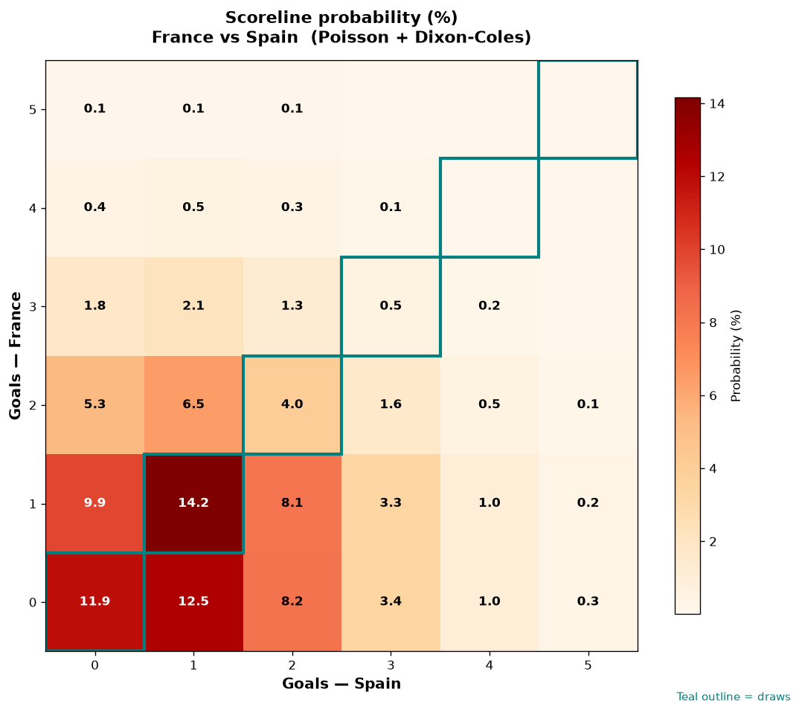

# France vs Spain — 2026-07-14

*Stage:* semi  ·  *Engine:* Poisson bivariate + Dixon-Coles + Monte Carlo

## Expected goals (model)

- **France**: 0.99
- **Spain**: 1.23
- **Total**: 2.21  ·  rho = -0.0704

## 1X2 (match result)

| Outcome | Model |
|---|---|
| France win | **28.7%** |
| Draw | **30.6%** |
| Spain win | **40.7%** |

*Monte Carlo (50,000 sims):* 28.7% / 30.6% / 40.7% · avg goals 2.21

## Most likely scorelines

- 1-1: 14.2%
- 0-1: 12.5%
- 0-0: 11.9%
- 1-0: 9.9%
- 0-2: 8.2%
- 1-2: 8.1%

## Derived markets

- Both teams to score: 45.2%
- Over 2.5 goals: 38.0%  ·  Under 2.5: 62.0%
- Double chance 1X: 59.3%  ·  X2: 71.3%

## Knockout advancement (incl. extra time + penalties)

- **France advances**: 43.1%
- **Spain advances**: 56.9%

## Scoreline heatmap

---
*Informational model output — not betting advice.*