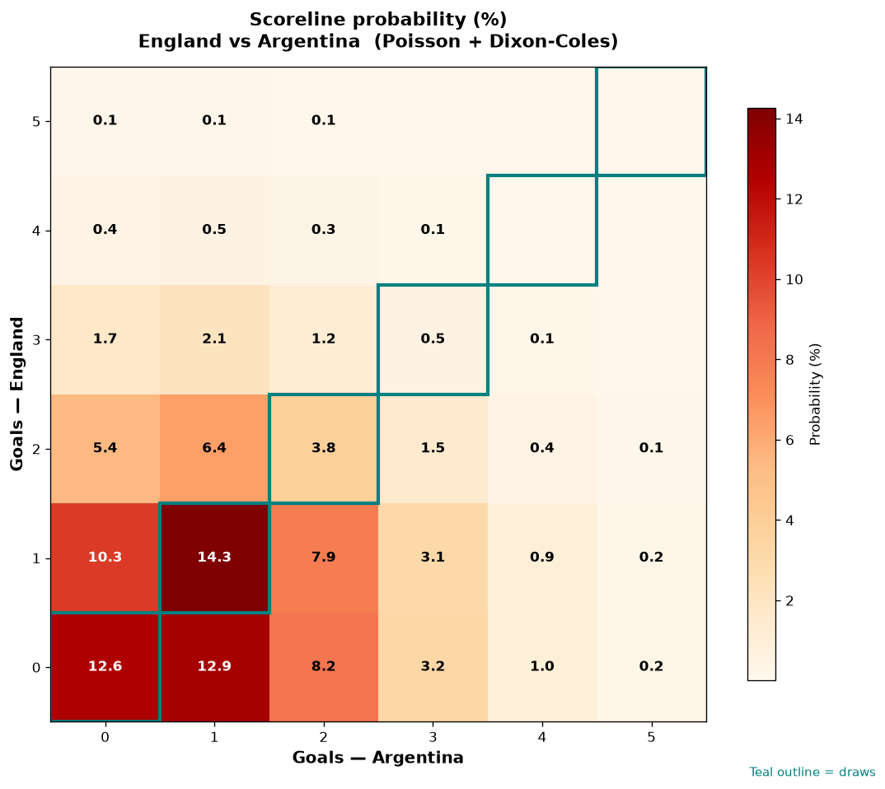

# England vs Argentina — 2026-07-15

*Stage:* semi  ·  *Engine:* Poisson bivariate + Dixon-Coles + Monte Carlo

## Expected goals (model)

- **England**: 0.96
- **Argentina**: 1.18
- **Total**: 2.15  ·  rho = -0.0704

## 1X2 (match result)

| Outcome | Model |
|---|---|
| England win | **28.9%** |
| Draw | **31.2%** |
| Argentina win | **39.9%** |

*Monte Carlo (50,000 sims):* 28.9% / 31.3% / 39.8% · avg goals 2.15

## Most likely scorelines

- 1-1: 14.3%
- 0-1: 12.9%
- 0-0: 12.6%
- 1-0: 10.3%
- 0-2: 8.2%
- 1-2: 7.9%

## Derived markets

- Both teams to score: 43.8%
- Over 2.5 goals: 36.3%  ·  Under 2.5: 63.7%
- Double chance 1X: 60.1%  ·  X2: 71.1%

## Knockout advancement (incl. extra time + penalties)

- **England advances**: 43.6%
- **Argentina advances**: 56.4%

## Scoreline heatmap

---
*Informational model output — not betting advice.*