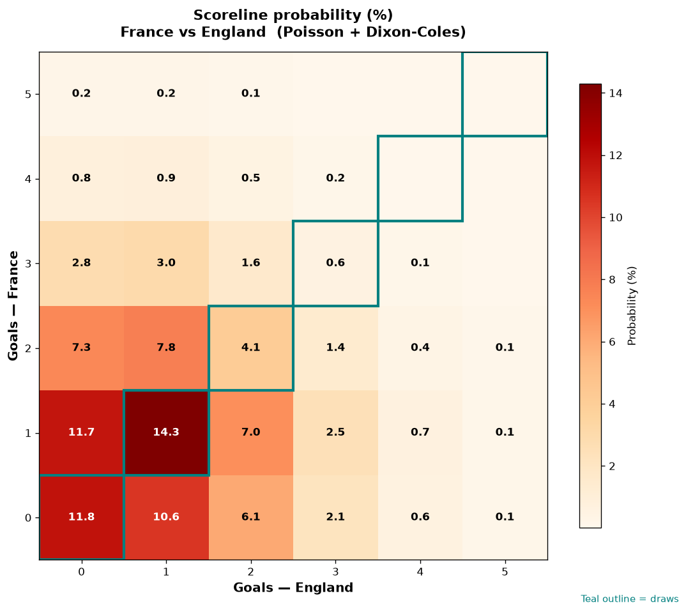

# France vs England — 2026-07-18

*Stage:* final  ·  *Engine:* Poisson bivariate + Dixon-Coles + Monte Carlo

## Expected goals (model)

- **France**: 1.16
- **England**: 1.06
- **Total**: 2.22  ·  rho = -0.0707

## 1X2 (match result)

| Outcome | Model |
|---|---|
| France win | **37.2%** |
| Draw | **30.8%** |
| England win | **31.9%** |

*Monte Carlo (50,000 sims):* 37.3% / 30.7% / 32.0% · avg goals 2.22

## Most likely scorelines

- 1-1: 14.3%
- 0-0: 11.8%
- 1-0: 11.7%
- 0-1: 10.6%
- 2-1: 7.8%
- 2-0: 7.3%

## Derived markets

- Both teams to score: 45.7%
- Over 2.5 goals: 38.2%  ·  Under 2.5: 61.8%
- Double chance 1X: 68.1%  ·  X2: 62.8%

## Knockout advancement (incl. extra time + penalties)

- **France advances**: 53.1%
- **England advances**: 46.9%

## Scoreline heatmap

---
*Informational model output — not betting advice.*