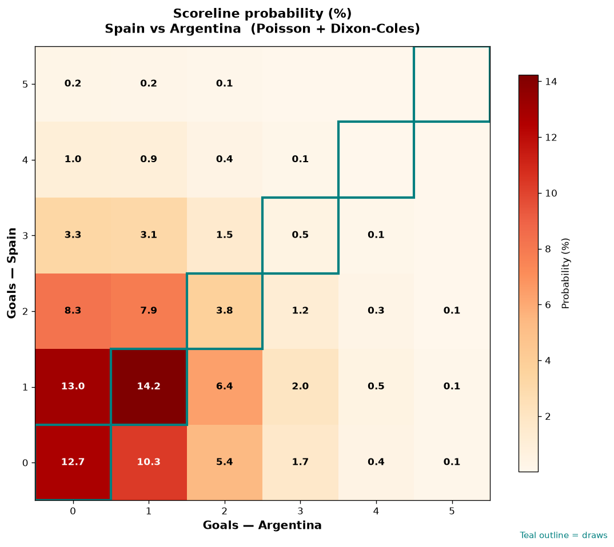

# Spain vs Argentina — 2026-07-19

*Stage:* final  ·  *Engine:* Poisson bivariate + Dixon-Coles + Monte Carlo

## Expected goals (model)

- **Spain**: 1.19
- **Argentina**: 0.95
- **Total**: 2.14  ·  rho = -0.0693

## 1X2 (match result)

| Outcome | Model |
|---|---|
| Spain win | **40.3%** |
| Draw | **31.2%** |
| Argentina win | **28.5%** |

*Monte Carlo (50,000 sims):* 40.3% / 31.1% / 28.7% · avg goals 2.14

## Most likely scorelines

- 1-1: 14.2%
- 1-0: 13.0%
- 0-0: 12.7%
- 0-1: 10.3%
- 2-0: 8.3%
- 2-1: 7.9%

## Derived markets

- Both teams to score: 43.6%
- Over 2.5 goals: 36.1%  ·  Under 2.5: 63.9%
- Double chance 1X: 71.5%  ·  X2: 59.7%

## Knockout advancement (incl. extra time + penalties)

- **Spain advances**: 56.7%
- **Argentina advances**: 43.3%

## Scoreline heatmap

---
*Informational model output — not betting advice.*